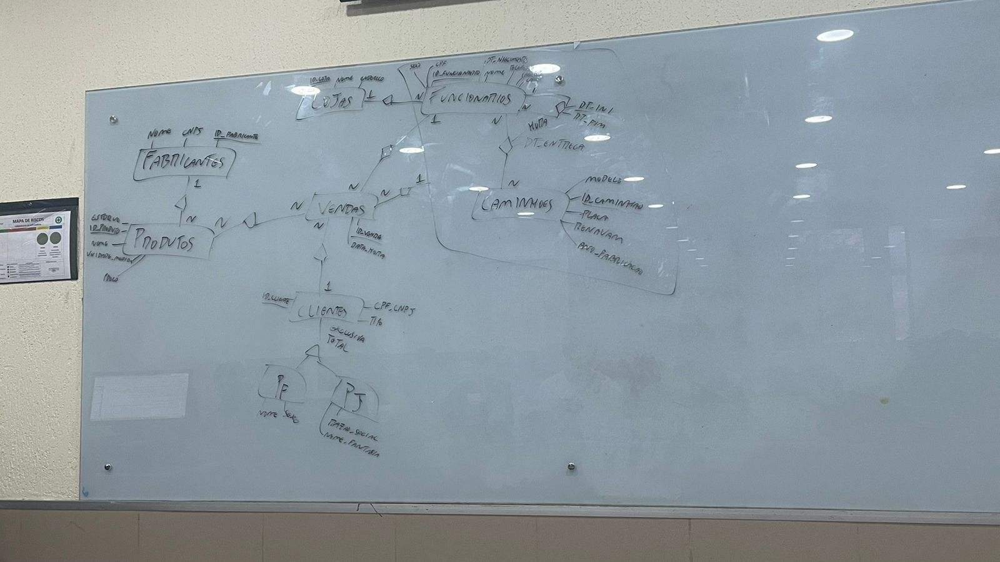
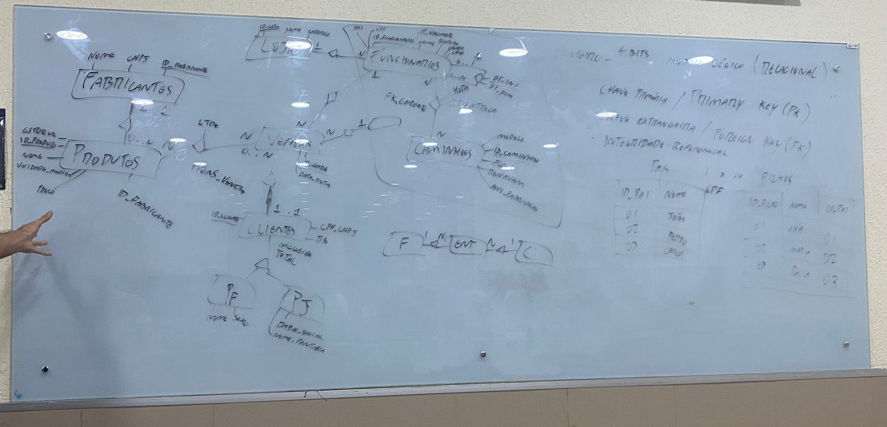

# Aula 01

## Projeto de BD

- Analise de Requisitos - Técnico
    * Desenvolvedor 

- Modelo descritivo - Não técnico 
    * Cliente / Usuário

  
## Diagrama de entidade-relacionamento (DER)

Um diagrama entidade-relacionamento (DER) é uma forma de representar graficamente a estrutura lógica de um banco de dados, mostrando as entidades, os atributos e os relacionamentos entre elas. Existem diferentes ferramentas que podem ajudar você a criar um DER, como o Microsoft Word, o Microsoft Visio, o GitMind e o Lucidchart. Cada ferramenta tem suas próprias características e vantagens, mas o processo básico é semelhante. Veja a seguir alguns passos comuns para criar um DER:

- Identifique as entidades principais do seu domínio de problema. As entidades são os objetos ou conceitos que você quer armazenar no banco de dados, como pessoas, produtos, pedidos, etc. As entidades são representadas por retângulos com o nome da entidade dentro.
- Defina os atributos que descrevem as entidades. Os atributos são as propriedades ou características das entidades, como nome, idade, preço, quantidade, etc. Os atributos são representados por elipses com o nome do atributo dentro. Os atributos que servem como identificadores únicos das entidades são sublinhados.
- Estabeleça os relacionamentos entre as entidades. Os relacionamentos mostram como as entidades se associam umas com as outras, como compra, contém, faz, etc. Os relacionamentos são representados por losangos com o nome do relacionamento dentro. As entidades e os relacionamentos são conectados por linhas que indicam a cardinalidade do relacionamento, ou seja, quantas ocorrências de uma entidade se relacionam com quantas ocorrências de outra entidade. As cardinalidades podem ser de um-para-um, um-para-muitos, muitos-para-um ou muitos-para-muitos, e são representadas por símbolos como 1, N, |, O, etc.
- Revise e ajuste o seu diagrama. Verifique se o seu diagrama está claro, completo e consistente com os requisitos do seu banco de dados. Você pode usar cores, fontes, tamanhos e formas diferentes para destacar os elementos mais importantes do seu diagrama. Você também pode adicionar notas, legendas, títulos e outras informações complementares ao seu diagrama.

Para ver exemplos de como fazer um DER usando as ferramentas mencionadas, você pode acessar os seguintes links:

- [Como fazer um diagrama entidade relacionamento | Lucidchart](^1^)
- [Como Criar Diagrama Entidade Relacionamento no Word, Visio, Online? - GitMind](^2^)
- [Modelo para Diagrama de Entidade e Relacionamento | Exemplos - Miro](^3^)

Referencias: 
1. [Como fazer um diagrama entidade relacionamento | Lucidchart](https://www.lucidchart.com/pages/pt/como-fazer-um-diagrama-entidade-relacionamento)
2. [Como Criar Diagrama Entidade Relacionamento no Word, Visio - GitMind](https://gitmind.com/pt/criar-diagrama-entidade-relacionamento.html)
3. [Modelo para Diagrama de Entidade e Relacionamento | Exemplos - Miro. ](https://miro.com/pt/modelos/diagrama-entidades-relacionamento/)

## Modelo conceitual/lógico vs Fisico

Um modelo conceitual/lógico é uma representação visual abstrata das principais entidades, relacionamentos e atributos de um domínio específico. Ele é usado para descrever a estrutura lógica de um banco de dados antes de ser implementado em um sistema de gerenciamento de banco de dados (SGBD). Um modelo conceitual/lógico é independente de qualquer tecnologia ou plataforma específica¹².

O modelo lógico é independente de qualquer tecnologia ou plataforma específica, e serve como um modelo para projetar bancos de dados. Ele foca nos conceitos e regras de negócio do domínio, e define as entidades, atributos, relacionamentos e restrições dos dados. O modelo lógico também determina se todos os requisitos do negócio foram reunidos, e é revisado pelos desenvolvedores, pelo gerenciamento e pelos usuários finais³⁴.

Um modelo físico é a implementação real do banco de dados em um SGBD específico. Ele leva em conta as limitações e recursos do SGBD escolhido, como o tipo de dados, os índices, as restrições, os gatilhos, etc. Um modelo físico é dependente de uma tecnologia ou plataforma específica¹².

A diferença entre um modelo conceitual/lógico e um modelo físico é principalmente de escala e profundidade. O modelo conceitual/lógico é de alto nível e foca nos conceitos e regras de negócio do domínio. O modelo físico é de baixo nível e foca nos detalhes técnicos e operacionais do banco de dados. O modelo conceitual/lógico é mais fácil de compreender e comunicar, enquanto o modelo físico é mais complexo e específico³⁴.

Referencias: 
1. [Qual a difr.nça entre modelagem conceitual, lógica e física?](https://pt.stackoverflow.com/questions/294699/qual-a-diferen%c3%a7a-entre-modelagem-conceitual-l%c3%b3gica-e-f%c3%adsica)
2. [Modelagem e dados: modelo conceitual, modelo lógico e físico](https://www.luis.blog.br/modelagem-de-dados-modelo-conceitual-modelo-logico-e-fisico.html)
3. [Modelo Conceitual de Banco de Dados: Uma Visão Abrangente](https://federalcubatao.com.br/banco-de-dados/modelo-conceitual-de-banco-de-dados-uma-visao-abrangente/)
4. [Qual é a diferença entre um modelo conceitual e um modelo físico](https://www.tabonfils.com/qual-e-a-diferenca-entre-um-modelo-conceitual-e-um-modelo-fisico/)

## Entidade

Uma entidade de banco de dados é um objeto que existe e é distinguível dos outros objetos. Por exemplo, uma pessoa, uma empresa, um livro, um produto, etc. Uma entidade pode ter atributos, que são as propriedades ou características que a descrevem. Por exemplo, uma entidade pessoa pode ter atributos como nome, idade, endereço, etc. Uma entidade pode fazer parte de um conjunto de entidades, que é uma coleção de entidades do mesmo tipo que compartilham as mesmas propriedades. Por exemplo, o conjunto de todas as pessoas com conta em um banco pode ser definido como o conjunto de entidades cliente.

Uma entidade se difere de outras entidades pelo seu identificador, que é um atributo ou uma combinação de atributos que permite distinguir uma entidade de outra dentro de um mesmo conjunto. Por exemplo, uma entidade pessoa pode ser identificada pelo seu CPF, que é um número único para cada cidadão brasileiro. Uma entidade também se difere de outras entidades pelo seu grau de abstração, que é o nível de detalhamento que se quer representar. Por exemplo, uma entidade pessoa pode ser representada de forma genérica, como uma entidade forte, ou de forma específica, como uma entidade fraca dependente de outra entidade, como aluno, professor, funcionário, etc.

Referenca.: 
1. [Entidade · Banco de dados - Modelagem de dados](https://fabiojaniolima.gitbooks.io/banco-de-dados-modelagem-de-dados/caitulo-2/2.1-entidade.html)
2. [Modelagem de Dados: Entidades - DevMedia](https://www.devmedia.com.br/modelagem-de-dados-1-entidades/4140)
3. [O que e uma entidade em um banco de dados? – ConselhosRapidos](https://bing.com/search?q=Descrva+um+entidade+de+banco+dados+%c3%a9+o+que+a+difere)
4. [O que e uma entidade em um banco de dados? -ConselhosRapidos](https://conselhosrapidos.com.br/o-que-e-uma-entidade-em-um-banco-de-dados/)
5. [Capítulo 2 Modelo Entidade - UFSC](http://www.inf.ufsc.br/~mario/cap2texto.pdf)

## Fotos da Aula

## Conteúdo Extra

* [Dados, Informação, Conhecimento, Ideia e Sabedoria](https://mobimais.com.br/blog/dados-informacao-conhecimento-ideia-e-sabedoria/)

* [Livro: Projeto de banco de dados](./doc/Projeto%20de%20Banco%20de%20Dados%20-%20C.%20A.%20Heuser.pdf)
* [Abordagem Entidade-relacionamento](https://sites.unipampa.edu.br/cienciacao/2021/03/15/abordagem-entidade-relacionamento-er/)
* [Livro: MySql Comece com o principal banco de dados open source do mercado](./doc/mysql-Comece-com-o-principal-banco-de-dados-open-source-do-mercado.pdf)
* [Livro: Postgresql - Banco de Dados Para Aplicacoes Web Modernas - Casa Do Codigo](./doc/Postgresql-Banco-de-Dados-Para-Aplicacoes-Web-Modernas-Casa-Do-Codigo.pdf)
* [Livro: PLSQL Domine a linguagem do banco de dados Oracle](./doc/PLSQL-Domine-a-linguagem-do-banco-de-dados-Oracle.pdf)

------------

[Home 🏠](../README.md) | [Indice 📇](README.md)
