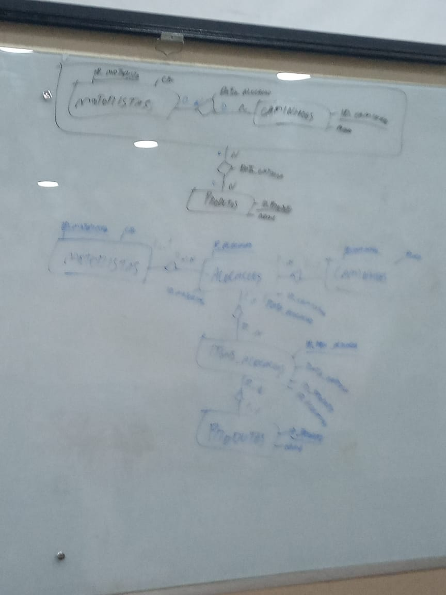
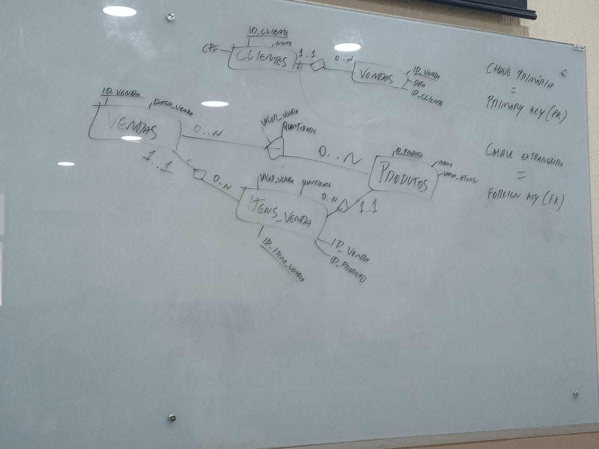

# Aula 02

### Modelo Descritivo

Um modelo descritivo de banco de dados é um modelo que representa a estrutura e o conteúdo de um banco de dados de forma clara e compreensível. Um modelo descritivo pode ser usado para documentar, analisar, projetar ou implementar um banco de dados. Existem diferentes tipos de modelos descritivos, dependendo do nível de abstração, da tecnologia e do propósito que se quer atingir. 

### Modelo Conceitual ( MER -> DER )

É o modelo de mais alto nível, que descreve os conceitos e as relações importantes do domínio do problema, sem se preocupar com os detalhes técnicos de como os dados serão armazenados ou manipulados. Um modelo conceitual pode ser representado por meio de um diagrama entidade-relacionamento (DER) ou um diagrama de classes, por exemplo.


- Entidade
- Relacionamentos
- Atributos
- Cardinalidade
- Especialização
- Atributo Identificador

### Modelo Lógico

É o modelo que descreve como os dados serão organizados em tabelas, colunas, linhas, chaves e restrições, seguindo alguma tecnologia específica, como o modelo relacional, o modelo de rede, o modelo hierárquico, o modelo orientado a objetos, etc. Um modelo lógico pode ser representado por meio de um esquema relacional, um diagrama de rede, um diagrama hierárquico, etc.

- Atributo
- Chave Primaria ( Primary Key)
- Chave Estrangeira ( Foreign Key)


### Modelo físico

É o modelo que descreve como o banco de dados será implementado em um sistema de gerenciamento de banco de dados (SGBD) específico, levando em conta as características e as limitações do SGBD, como os tipos de dados, os índices, os gatilhos, os procedimentos armazenados, etc. Um modelo físico pode ser representado por meio de um código SQL, um script, um arquivo de configuração, etc.

## MS SQL Server

Utilizado para pratica no banco de dados

[Download do SQL Server](https://www.microsoft.com/pt-br/sql-server/sql-server-downloads)

[Tipos de dados - Documentação](https://learn.microsoft.com/pt-br/sql/t-sql/data-types/data-types-transact-sql?view=sql-server-2017)

### SQL - DDL

A DDL (Data Definition Language) engloba os comandos de definição do banco de dados. 

- CREATE TABLE
- ALTER TABLE 

Criar tabela CLIENTES

```sql

CREATE TABLE CLIENTES (
    ID_CLIENTE INT NOT NULL IDENTITY (1,1),
    NOME VARCHAR(255),
    SEXO CHAR(1),
    CPF CHAR(11) NOT NULL,
    UF CHAR(2) CONSTRAINT DEF_CLIENTES_UF DEFAULT 'PB',
CONSTRAINT PK_CLIENTES PRIMARY KEY (ID_CLIENTE),
CONSTRAINT CHK_CLIENTES_SEXO CHECK (SEXO IN ('M','F')),
CONSTRAINT UNQ_CLIENTES_CPF UNIQUE (CPF),
CONSTRAINT CHK_CLIENTES_UF CHECK (UF IN ('PB','PE')) 

) ;

```
Criar tabela VENDAS

```sql
CREATE TABLE VENDAS (
    ID_VENDA INT NOT NULL IDENTITY (1,1),
    DATA DATE NOT NULL,
    ID_CLIENTE INT NOT NULL,

    CONSTRAINT PK_VENDAS PRIMARY KEY (ID_VENDA),
    CONSTRAINT FK_VENDAS_CLIENTES FOREIGN KEY (ID_CLIENTE) REFERENCES CLIENTES (ID_CLIENTE) ON UPDATE CASCADE ON DELETE NO ACTION
);

```
### SQL - DQL

A DQL (Data Query Language) é o subconjunto responsável por comandos de consulta aos dados armazenados. Dentro dele, encontramos apenas o comando Select. É importante observar que em alguns materiais acadêmicos essa instrução aparece incorporada no conjunto DML,

- SELECT

### SQL - DML

A DML (Data Manipulation Language) corresponde aos comandos de manipulação dos dados. Composta de apenas três comandos, envolve interações de armazenamento, modificação, exclusão, inserção e atualização.

- INSERT
- DELETE
- UPDATE

Inserir registro

```sql
INSERT INTO MBA.DBO.CLIENTES (
    NOME,
    SEXO,
    CPF,
    UF
) VALUES (
    'JOAO SILVA',
    'M',
    '00223423312',
    'PB'
);
```

### SQL - DCL 

 Esse subconjunto do SQL envolve comandos relacionados à segurança do banco de dados. A DCL (Data Control Language) controla o acesso aos dados, tanto concedendo privilégio de acesso, quanto retirando a permissão do usuário ou usuária.

 * GRANT
 * REVOKE

-----

## Fotos da aula




## Referencias

- [Normalizando um banco de dados por meio das 3 principais formas](https://spaceprogrammer.com/bd/normalizando-um-banco-de-dados-por-meio-das-3-principais-formas/)
- [Recapitulando: normalização de banco de dados relacionais](http://www.dsc.ufcg.edu.br/~pet/jornal/maio2011/materias/recapitulando.html)
-------------

[Home 🏠](../README.md) | [Indice 📇](README.md)