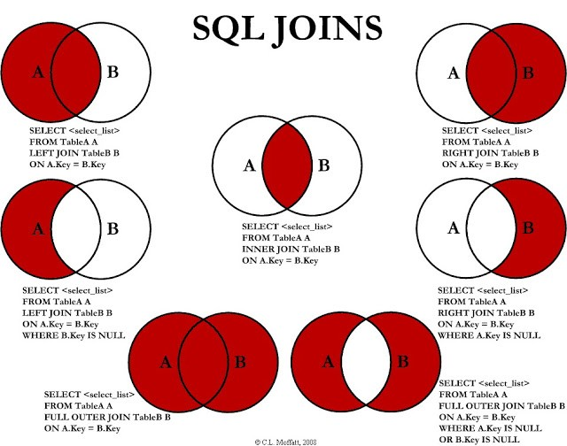

# Aula 03

Instruções SQL no SQL Server.

- [SQL com criação do banco de dados](./doc/01-criacao_do_ambiente.sql)
- [SQL com instruções para inserir dados](./doc/02-insercao-dos-dados.sql)
- [SQL comandos DML Avançados](./doc/03-Comandos-DML-Avancados.sql)

- [Tutorial de SQL](https://www.tutorialspoint.com/sql/index.htm)

## CONSTRAINTS

Utilizando [CONSTRAINTS](./constraints.md)

## SQL Joins

Os joins em SQL Server são usados para combinar dados de duas ou mais tabelas com base em uma coluna relacionada entre elas. Existem quatro tipos de operações de junção física que o SQL Server usa para executar as operações de junção lógica: Nested Loops joins, Merge joins, Hash joins e Adaptive joins (a partir do SQL Server 2017). As operações de junção lógica incluem Inner join, Left outer join, Right outer join, Full outer join e Cross join.

A cláusula FROM é usada para especificar as tabelas que estão sendo unidas, enquanto a cláusula ON é usada para especificar as condições de junção. As condições de junção combinam com as condições de pesquisa WHERE e HAVING para controlar as linhas que são selecionadas das tabelas base referenciadas na cláusula FROM.

```sql

SELECT C.IDCLIENTE, C.NOME, V.DATA
FROM CLIENTES C
INNER JOIN VENDAS V ON (V.IDCLIENTE = C.IDCLIENTE);
GO

SELECT C.IDCLIENTE, C.NOME, V.DATA
FROM CLIENTES C 
LEFT OUTER JOIN VENDAS V ON (V.IDCLIENTE = C.IDCLIENTE);
GO

```
Usando `join`, você pode recuperar dados de duas ou mais tabelas com base em relações lógicas entre as tabelas. As junções indicam como o SQL Server deve usar dados de uma tabela para selecionar as linhas em outra tabela.

Uma condição de associação define a maneira como duas tabelas são relacionadas em uma consulta por:

- Especificando a coluna de cada tabela a ser usada para a junção. Uma condição de junção típica especifica uma chave estrangeira de uma tabela e sua chave associada na outra tabela.
- Especificar um operador lógico (por exemplo, = ou <>,) a ser usado na comparação de valores das colunas.



## Common Table Expression ( CTE )

Common Table Expression (CTE) é uma expressão de tabela temporária que pode ser referenciada em uma consulta SELECT, INSERT, UPDATE ou DELETE. Ela é definida usando a cláusula WITH e é usada para melhorar a legibilidade e reutilização de consultas complexas.
A sintaxe básica para criar uma CTE é a seguinte:
```sql
WITH nome_da_cte (coluna1, coluna2, ...) AS (
    SELECT coluna1, coluna2, ...
    FROM tabela
    WHERE condição
)
SELECT *
FROM nome_da_cte;
```
Aqui, nome_da_cte é o nome da expressão de tabela comum, coluna1, coluna2, etc. são as colunas que serão retornadas pela CTE e tabela é a tabela que está sendo consultada. A cláusula WHERE é usada para especificar as condições de pesquisa.
As CTEs podem ser usadas para criar subconsultas nomeadas que podem ser referenciadas em outras partes da consulta. Isso pode tornar as consultas mais fáceis de ler e entender. Para mais informações sobre CTEs em SQL Server, consulte o artigo da Microsoft Learn .

Referencias:
- [Understanding Common Table Expressions (CTEs) in SQL Server for Beginners](https://sqlpad.io/tutorial/understanding-common-table-expressions-ctes-in-sql-server-for-beginners/)
- [WITH common_table_expression (Transact-SQL)](https://learn.microsoft.com/pt-br/sql/t-sql/queries/with-common-table-expression-transact-sql?view=sql-server-ver16)
- [A Guide to SQL Common Table Expressions](https://learnsql.com/blog/sql-common-table-expression-guide/)

## Ranking Function

As funções de classificação em SQL Server são usadas para classificar linhas em uma tabela com base em uma coluna ou conjunto de colunas. As funções de classificação retornam um valor de classificação para cada linha em uma partição. Dependendo da função usada, algumas linhas podem receber o mesmo valor que outras linhas. As funções de classificação são não determinísticas.

O SQL Server fornece as seguintes funções de classificação: RANK, NTILE, DENSE_RANK e ROW_NUMBER   .
#### RANK()
A função RANK atribui um valor de classificação a cada linha em um conjunto de resultados. O valor de classificação é baseado na ordem das linhas no conjunto de resultados. Se duas ou mais linhas tiverem o mesmo valor, elas receberão o mesmo valor de classificação e a próxima linha receberá o próximo valor de classificação disponível  .
Aqui está um exemplo de uso da função RANK:

```sql
SELECT nome, pontuacao, RANK() OVER (ORDER BY pontuacao DESC) AS 'Ranking'
FROM tabela
ORDER BY Ranking;
```

Isso retornará todas as linhas da tabela, classificadas por pontuação em ordem decrescente, com um valor de classificação atribuído a cada linha .
Para mais informações sobre funções de classificação em SQL Server, consulte o artigo da Microsoft Learn .

Referencias:

- [Ranking Functions](https://learn.microsoft.com/en-us/sql/t-sql/functions/ranking-functions-transact-sql?view=sql-server-ver16)
  
#### NTILE()

A função de classificação NTILE em SQL Server é usada para dividir um conjunto de resultados em um número especificado de grupos de tamanho aproximadamente igual. Cada linha é atribuída a um grupo com base em seu valor de classificação. 

A função NTILE é útil quando você deseja dividir as linhas em partes iguais em uma partição. Para usar essa função de classificação, você deve especificar quantas categorias deseja dividir as linhas. Se o número total de linhas não for divisível pelo número total de grupos, alguns dos grupos receberão uma linha extra   .
Aqui está um exemplo de uso da função NTILE:
```sql
SELECT nome, pontuacao, NTILE(4) OVER (ORDER BY pontuacao DESC) AS 'Quartil'
FROM tabela
ORDER BY Quartil;
```
Isso retornará todas as linhas da tabela, classificadas por pontuação em ordem decrescente, com um valor de classificação atribuído a cada linha. O valor de classificação é baseado na ordem das linhas no conjunto de resultados. Se duas ou mais linhas tiverem o mesmo valor, elas receberão o mesmo valor de classificação e a próxima linha receberá o próximo valor de classificação disponível .
Aqui está outro exemplo de uso da função NTILE:
```sql
WITH CTE AS (
    SELECT nome, pontuacao, NTILE(4) OVER (ORDER BY pontuacao DESC) AS 'Quartil'
    FROM tabela
)
SELECT nome, pontuacao, Quartil
FROM CTE
WHERE Quartil = 1;
```
Isso retornará todas as linhas da tabela onde o valor de classificação é igual a 1 .

Referencias: 

- [T-SQL NTILE](https://www.tsql.info/functions/ntile.php)
- [SQL Server NTILE Function](https://www.sqlservertutorial.net/sql-server-window-functions/sql-server-ntile-function/)

#### DENSE_RANK()
A função de classificação DENSE_RANK em SQL Server é usada para atribuir um valor de classificação a cada linha em um conjunto de resultados, começando com 1 para a primeira linha. Ao contrário da função RANK, a função DENSE_RANK não pula valores de classificação quando há empates. Isso pode ser útil quando você deseja saber a posição relativa das linhas dentro de um conjunto de resultados. 

As linhas em cada partição recebem os mesmos valores de classificação se tiverem os mesmos valores. 

A função DENSE_RANK é não determinística.
Aqui está um exemplo de uso da função DENSE_RANK:
```sql
SELECT nome, pontuacao, DENSE_RANK() OVER (ORDER BY pontuacao DESC) AS 'Ranking denso'
FROM tabela
ORDER BY Ranking denso;
```
Isso retornará todas as linhas da tabela, classificadas por pontuação em ordem decrescente, com um valor de classificação atribuído a cada linha. O valor de classificação é baseado na ordem das linhas no conjunto de resultados. Se duas ou mais linhas tiverem o mesmo valor, elas receberão o mesmo valor de classificação e a próxima linha receberá o próximo valor de classificação disponível.

Referencias:

- [SQL Server DENSE_RANK Function](https://www.sqlservertutorial.net/sql-server-window-functions/sql-server-dense_rank-function/)
- [SQL DENSE_RANK](https://www.sqltutorial.org/sql-window-functions/sql-dense_rank/)
#### ROW_NUMBER()

A função de classificação ROW_NUMBER em SQL Server é usada para atribuir um número sequencial a cada linha em um conjunto de resultados. O valor de classificação é baseado na ordem das linhas no conjunto de resultados. A função ROW_NUMBER é não determinística.
Aqui está um exemplo de uso da função ROW_NUMBER:

SELECT nome, pontuacao, ROW_NUMBER() OVER (ORDER BY pontuacao DESC) AS 'Ranking'
FROM tabela
ORDER BY Ranking;

Isso retornará todas as linhas da tabela, classificadas por pontuação em ordem decrescente, com um valor de classificação atribuído a cada linha.

Referencias:

- [SQL Server Ranking Functions Row_Number and Rank](https://www.mssqltips.com/sqlservertip/1944/sql-server-ranking-functions-rownumber-and-rank/)
- [Overview of SQL RANK functions](https://www.mssqltips.com/sqlservertip/1944/sql-server-ranking-functions-rownumber-and-rank/)

## HAVING

A cláusula HAVING em SQL Server é usada para filtrar os resultados de uma consulta agregada. Ela é usada em conjunto com a cláusula GROUP BY para especificar uma condição de pesquisa para um grupo ou agregado. A cláusula HAVING é usada para filtrar grupos com base em uma condição de pesquisa, enquanto a cláusula WHERE é usada para filtrar linhas individuais.
Aqui está um exemplo de uso da cláusula HAVING:

```sql
SELECT coluna1, coluna2, AVG(coluna3) AS media
FROM tabela
GROUP BY coluna1, coluna2
HAVING AVG(coluna3) > 50;
```

Isso retornará as colunas coluna1, coluna2 e a média da coluna3 para cada grupo de coluna1 e coluna2 onde a média da coluna3 é maior que 50.

Referencias:

- [SELECT – HAVING (Transact-SQL)](https://learn.microsoft.com/pt-br/sql/t-sql/queries/select-having-transact-sql?view=sql-server-ver16)
- [Cláusulas GROUP BY e HAVING (U-SQL)](https://learn.microsoft.com/pt-br/u-sql/statements-and-expressions/select/group-by-and-having-clauses)
-----

## Exercícios 

- [Exercício 01 sem respostas](./doc/Exercicios_01_sem_respostas.sql)
- [Exercício 02 sem respostas](./doc/Exercicios_02_sem_respostas.sql)
- [Exercício 01 com respostas](./doc/Exercicios_01_com_respostas.sql)
- [Exercício 02 com respostas](./doc/Exercicios_02_com_respostas.sql)

---

## Fotos


---

[Home 🏠](../README.md) | [Indice 📇](README.md)