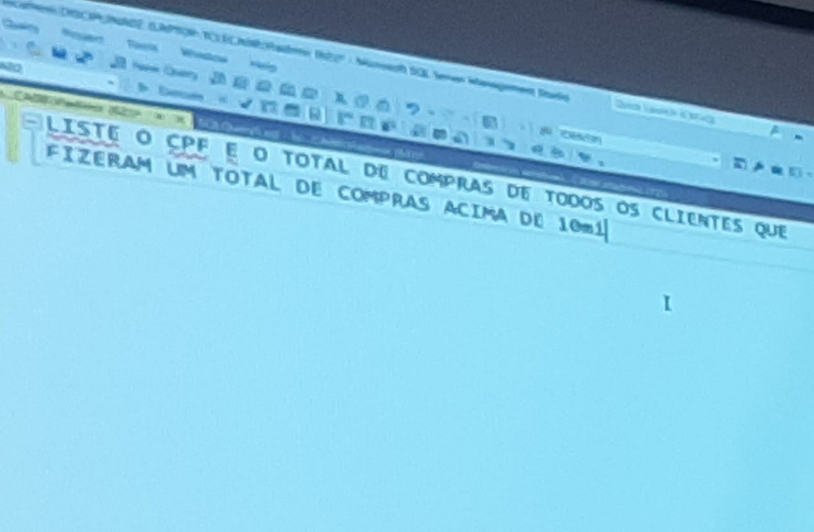

# Aula 06

- [Tipos de Join](./join.md)
- [Merge JOIN](./merge_join.md)
- [HASH JOIN](./hash_join.md)
- [Nested LOOP JOIN](./hash_join.md)
- [Windows Function](./windows_functions.md)

Enviados pelo professor:

- [Parte 5 - Windows functions](./doc/Parte_05_Windows_Functions.md)
- [Exercícios - Windows functions](./doc/exercicio_windows_functions.md)

## Similar no MySQL

- [JOIN no MySQL](./join_mysql.md)
- [Windows Function no MySQL](./windows_functions_mysql.md)

-----

## Fotos

-----

[Home 🏠](../README.md) | [Indice 📇](README.md)