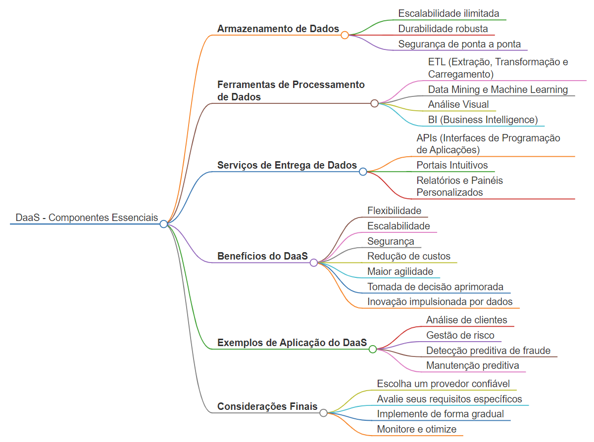

# Os Componentes Essenciais do DaaS (Data as a Service) em Detalhes

O **DaaS (Data as a Service)**, ou **Dados como Serviço**, revoluciona a forma como as empresas armazenam, processam e acessam dados. Através da nuvem, o DaaS oferece um modelo de entrega inovador que elimina a necessidade de infraestrutura local, proporcionando escalabilidade, flexibilidade e diversos benefícios estratégicos.

## Armazenamento de Dados Robusto e Escalável

No coração do DaaS reside o armazenamento de dados em nuvem. Soluções como **Amazon S3**, **Microsoft Azure Blob Storage** e **Google Cloud Storage** garantem:

* **Escalabilidade ilimitada:** A capacidade de armazenamento se adapta às suas necessidades, seja para lidar com petabytes de dados ou um simples aumento sazonal.
* **Durabilidade robusta:** Replicação de dados em vários data centers garante proteção contra falhas e indisponibilidades, minimizando o risco de perda de dados.
* **Segurança de ponta a ponta:** Criptografia robusta, controles de acesso granulares e firewalls garantem a confidencialidade e integridade dos seus dados.

## Ferramentas Poderosas para Processamento Eficaz de Dados

O DaaS vai além do armazenamento, oferecendo um arsenal de ferramentas para transformar dados brutos em insights acionáveis:

* **ETL (Extração, Transformação e Carregamento):** Automatize a transferência de dados de diversas fontes (bancos de dados, arquivos, APIs) para o armazenamento em nuvem, garantindo a qualidade e padronização dos dados.
* **Data Mining e Machine Learning:** Extraia padrões ocultos e construa modelos preditivos com ferramentas avançadas, como **Apache Spark**, **R** e **Python**.
* **Análise Visual:** Crie visualizações de dados impactantes com ferramentas como **Tableau**, **Power BI** e **Qlik Sense**, facilitando a compreensão e comunicação de insights.
* **BI (Business Intelligence):** Desenvolva relatórios e painéis interativos que fornecem uma visão holística do seu negócio, permitindo uma tomada de decisão mais ágil e estratégica.

## Entrega de Dados sob Medida para Cada Necessidade

O DaaS garante que seus dados cheguem ao público certo no momento certo, através de diversos canais:

* **APIs (Interfaces de Programação de Aplicações):** Permita que aplicativos e sistemas externos acessem e processem seus dados programaticamente, impulsionando a integração e automação.
* **Portais Intuitivos:** Ofereça interfaces web amigáveis que permitem aos usuários explorarem, visualizarem e analisarem dados de forma autônoma, sem depender de conhecimentos técnicos aprofundados.
* **Relatórios e Painéis Personalizados:** Crie relatórios e painéis pré-construídos ou personalizados para atender às necessidades específicas de cada usuário ou departamento, fornecendo insights relevantes e acionáveis.

## Exemplos Práticos do DaaS em Ação

* **Análise de Clientes para Experiências Personalizadas:** Imagine analisar dados de compras, navegação e interações na web para entender profundamente o comportamento do cliente. O DaaS permite que você personalize ofertas, promoções e conteúdo, impulsionando a fidelização e a satisfação do cliente.
* **Gestão de Risco Proativa no Setor Financeiro:** Analise dados de mercado, históricos de crédito e padrões de transações para avaliar o risco de investimentos e empréstimos com precisão. O DaaS contribui para decisões financeiras mais seguras e estratégicas, minimizando perdas e otimizando retornos.
* **Detecção Preditiva de Fraude no Varejo:** Combata a fraude de forma eficaz analisando dados de transações, histórico de compras e perfis de clientes. O DaaS permite identificar padrões anormais e agir de forma preventiva, protegendo seu negócio contra perdas financeiras.
* **Manutenção Preditiva para Indústrias Mais Eficientes:** Analise dados de sensores em equipamentos para prever falhas e agendar manutenções preventivas. O DaaS ajuda a evitar tempo de inatividade não planejado, otimizando a produção e reduzindo custos operacionais.

## Considerações Finais e Escolha Consciente do Provedor

O DaaS oferece um modelo de dados flexível, escalável e seguro, impulsionando a competitividade e a inovação nas empresas. No entanto, é crucial escolher um provedor confiável e experiente que atenda às suas necessidades específicas de segurança, conformidade e regulamentações de proteção de dados.

### **Ao avaliar provedores de DaaS, considere**

* **Histórico e reputação:** Opte por empresas com experiência comprovada no fornecimento de soluções DaaS a empresas de diversos setores.
* **Segurança e conformidade:** Verifique se o provedor atende aos seus requisitos de segurança, incluindo criptografia, controles de acesso, firewalls e certificações de conformidade com padrões como ISO 27001 e SOC 2.
* **Desempenho e escalabilidade:** Avalie a capacidade da plataforma para lidar com picos de demanda e garantir acesso rápido e confiável aos seus dados.
* **Integrações e interoperabilidade:** Verifique se a plataforma se integra com seus sistemas e ferramentas existentes, facilitando a migração de dados e a adoção do DaaS.
* **Suporte e treinamento:** Opte por um provedor que ofereça suporte técnico abrangente e treinamento para auxiliar na implementação, utilização e otimização da solução DaaS.

## Mapa mental

## Conclusão

O DaaS oferece um modelo de dados poderoso e flexível que impulsiona a transformação digital nas empresas. Ao escolher um provedor confiável e avaliar cuidadosamente seus requisitos, você pode desbloquear o potencial do DaaS para otimizar processos, tomar decisões mais inteligentes e alcançar um sucesso duradouro.

## **Lembre-se** 

O DaaS é uma jornada, não um destino. À medida que suas necessidades de dados evoluem, você pode expandir e adaptar sua solução DaaS para atender aos desafios e oportunidades do futuro.

## **Para mais informações**

* **DaaS: Um Guia Completo para Iniciantes** ([https://www.gartner.com/en/documents/3505027](https://www.gartner.com/en/documents/3505027))
* **5 Benefícios do Data as a Service (DaaS)** ([https://aws.amazon.com/es/application-hosting/benefits/](https://aws.amazon.com/es/application-hosting/benefits/))
* **10 Casos de Uso do Data as a Service (DaaS) que Transformam Negócios** ([https://dataconomy.com/2022/11/10/data-as-a-service-daas-examples-companies/](https://dataconomy.com/2022/11/10/data-as-a-service-daas-examples-companies/))

