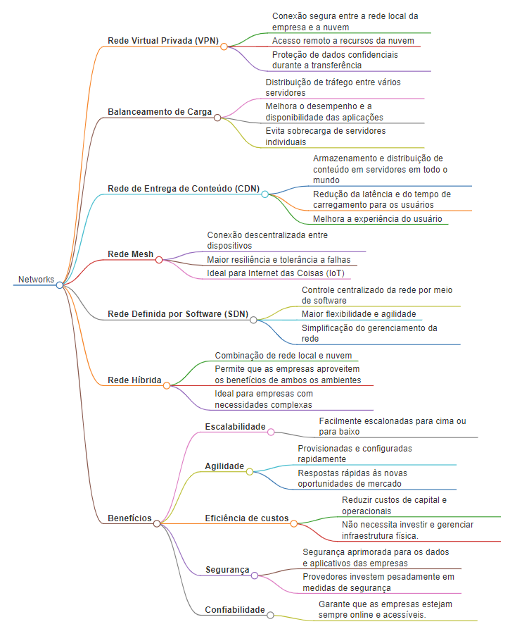

# Exemplos de Uso de Redes em Cloud Computing

**Rede Virtual Privada (VPN)**

* Conexão segura entre a rede local da empresa e a nuvem
* Acesso remoto a recursos da nuvem
* Proteção de dados confidenciais durante a transferência

**Balanceamento de Carga**

* Distribuição de tráfego entre vários servidores
* Melhora o desempenho e a disponibilidade das aplicações
* Evita sobrecarga de servidores individuais

**Rede de Entrega de Conteúdo (CDN)**

* Armazenamento e distribuição de conteúdo em servidores em todo o mundo
* Redução da latência e do tempo de carregamento para os usuários
* Melhora a experiência do usuário

**Rede Mesh**

* Conexão descentralizada entre dispositivos
* Maior resiliência e tolerância a falhas
* Ideal para Internet das Coisas (IoT)

**Rede Definida por Software (SDN)**

* Controle centralizado da rede por meio de software
* Maior flexibilidade e agilidade
* Simplificação do gerenciamento da rede

**Rede Híbrida**

* Combinação de rede local e nuvem
* Permite que as empresas aproveitem os benefícios de ambos os ambientes
* Ideal para empresas com necessidades complexas

**Benefícios do Uso de Redes em Cloud Computing**

* **Escalabilidade:** As redes em nuvem podem ser facilmente escalonadas para cima ou para baixo para atender às necessidades em constante mudança das empresas.
* **Agilidade:** As redes em nuvem podem ser provisionadas e configuradas rapidamente, o que permite que as empresas respondam rapidamente às novas oportunidades de mercado.
* **Eficiência de custos:** As redes em nuvem podem ajudar as empresas a reduzir custos de capital e operacionais, pois eliminam a necessidade de investir e gerenciar infraestrutura física.
* **Segurança:** As redes em nuvem podem fornecer segurança aprimorada para os dados e aplicativos das empresas, pois os provedores de nuvem investem pesadamente em medidas de segurança.
* **Confiabilidade:** As redes em nuvem são altamente confiáveis ​​e disponíveis, o que garante que as empresas estejam sempre online e acessíveis.

## Mapa mental

## Conclusão

As redes em nuvem são uma parte essencial da computação em nuvem e oferecem uma variedade de benefícios para as empresas. Ao usar redes em nuvem, as empresas podem escalar facilmente, aumentar a agilidade, reduzir custos, melhorar a segurança e aumentar a confiabilidade.

---

[Home 🏠](../../README.md) | [Anotações](../anotacoes.md)