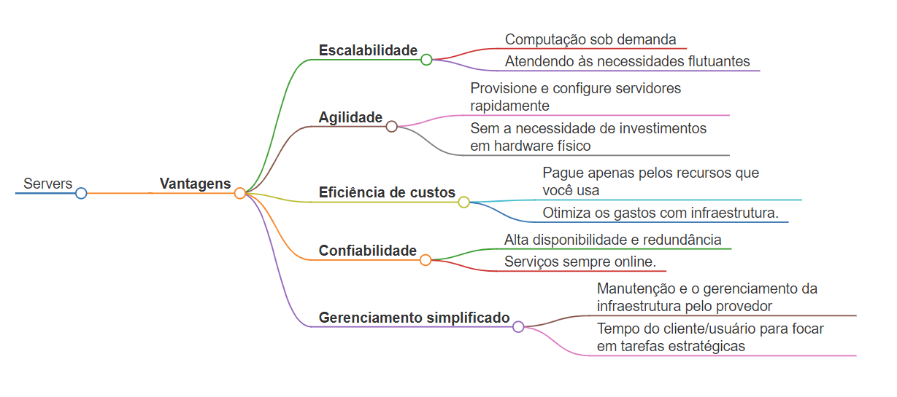
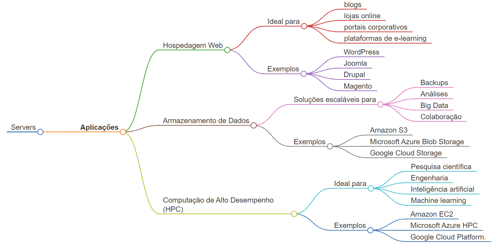
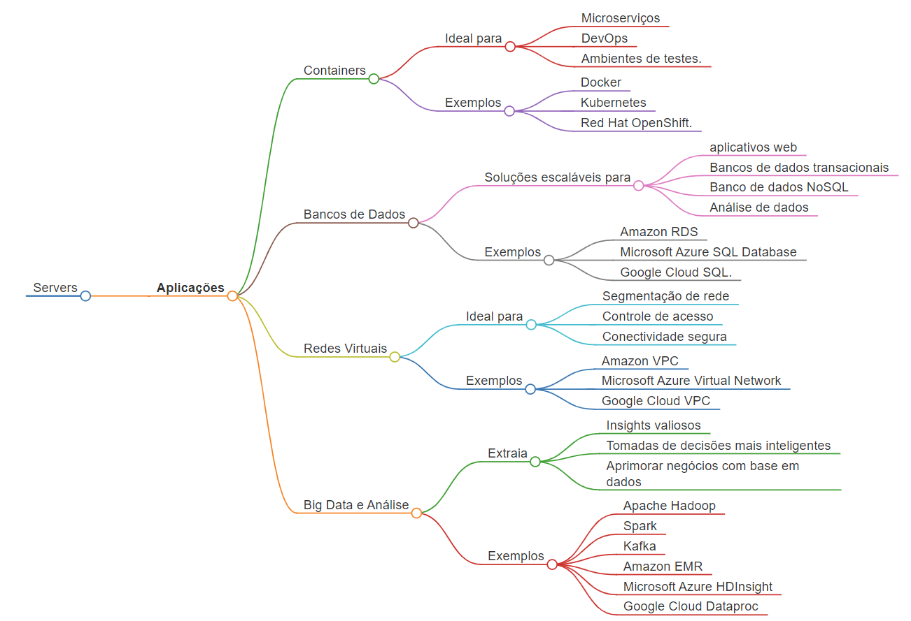
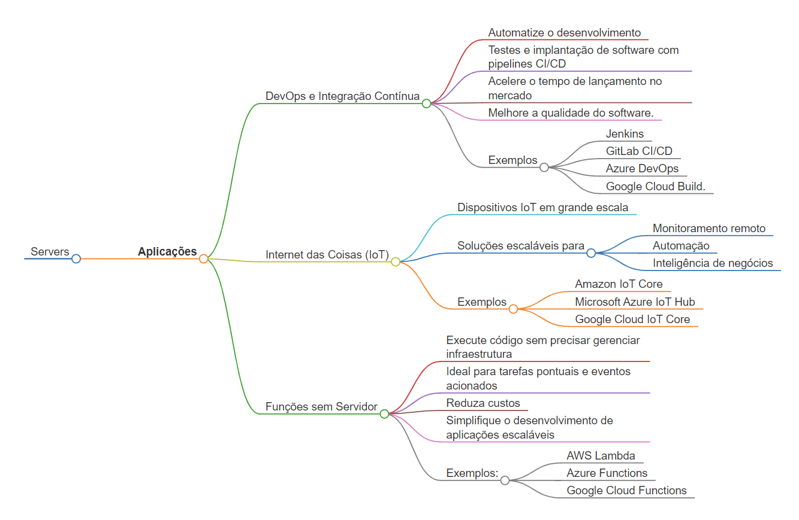

# Servidores na Nuvem - Usos Essenciais

## **Servidor na Nuvem** 

Instância virtual que executa aplicativos ou serviços para usuários em um ambiente de computação em nuvem.

### **Vantagens**

* **Escalabilidade** 
    - Aumente ou diminua os recursos de computação sob demanda, atendendo às necessidades flutuantes.
* **Agilidade** 
    - Provisione e configure servidores rapidamente, sem a necessidade de investimentos em hardware físico.
* **Eficiência de custos** 
    - Pague apenas pelos recursos que você usa, otimizando os gastos com infraestrutura.
* **Confiabilidade** 
    - Alta disponibilidade e redundância garantem que seus serviços estejam sempre online.
* **Gerenciamento simplificado** 
    - O provedor de nuvem lida com a manutenção e o gerenciamento da infraestrutura, liberando seu tempo para focar em tarefas estratégicas.

### **Aplicações**

**1. Hospedagem Web**

* Armazene e execute sites e aplicativos web com escalabilidade e confiabilidade.
* Ideal para blogs, lojas online, portais corporativos e plataformas de e-learning.
* Exemplos: WordPress, Joomla, Drupal, Magento.

**2. Armazenamento de Dados**

* Armazene, acesse e gerencie grandes volumes de dados com segurança e flexibilidade.
* Soluções escaláveis para backups, análises, Big Data e colaboração.
* Exemplos: Amazon S3, Microsoft Azure Blob Storage, Google Cloud Storage.

**3. Computação de Alto Desempenho (HPC)**

* Realize análises complexas, simulações científicas e modelagem de dados em larga escala.
* Ideal para pesquisa científica, engenharia, inteligência artificial e machine learning.
* Exemplos: Amazon EC2, Microsoft Azure HPC, Google Cloud Platform.

**4. Containers**

* Execute aplicativos em ambientes isolados e portáteis, facilitando o desenvolvimento e a implantação.
* Ideal para microserviços, DevOps e ambientes de testes.
* Exemplos: Docker, Kubernetes, Red Hat OpenShift.

**5. Bancos de Dados**

* Hospede e gerencie bancos de dados relacionais, NoSQL e em memória com alta disponibilidade.
* Soluções escaláveis para aplicativos web, bancos de dados transacionais e análise de dados.
* Exemplos: Amazon RDS, Microsoft Azure SQL Database, Google Cloud SQL.

**6. Redes Virtuais**

* Crie redes privadas e seguras na nuvem para conectar seus recursos e aplicativos.
* Ideal para segmentação de rede, controle de acesso e conectividade segura.
* Exemplos: Amazon VPC, Microsoft Azure Virtual Network, Google Cloud VPC.

**7. Big Data e Análise**

* Processe e analise grandes conjuntos de dados com ferramentas e frameworks poderosos.
* Extraia insights valiosos para tomar decisões mais inteligentes e aprimorar seus negócios.
* Exemplos: Apache Hadoop, Spark, Kafka, Amazon EMR, Microsoft Azure HDInsight, Google Cloud Dataproc.

**8. DevOps e Integração Contínua**

* Automatize o desenvolvimento, testes e implantação de software com pipelines CI/CD.
* Acelere o tempo de lançamento no mercado e melhore a qualidade do software.
* Exemplos: Jenkins, GitLab CI/CD, Azure DevOps, Google Cloud Build.

**9. Internet das Coisas (IoT)**

* Conecte, gerencie e analise dados de dispositivos IoT em grande escala.
* Soluções escaláveis para monitoramento remoto, automação e inteligência de negócios.
* Exemplos: Amazon IoT Core, Microsoft Azure IoT Hub, Google Cloud IoT Core.

**10. Funções sem Servidor**

* Execute código sem precisar gerenciar infraestrutura, ideal para tarefas pontuais e eventos acionados.
* Reduza custos e simplifique o desenvolvimento de aplicações escaláveis.
* Exemplos: AWS Lambda, Azure Functions, Google Cloud Functions.

## Mapa mental

### Vantagens

### Aplicações

## Conclusão 

* A computação em nuvem oferece flexibilidade, escalabilidade e custos otimizados para empresas de todos os portes.
* Avalie suas necessidades e explore as diversas soluções disponíveis para encontrar a melhor opção para o seu negócio.
* Esta lista não é exaustiva, existindo diversos outros casos de uso para servidores na nuvem.
* A escolha do tipo de servidor e provedor de nuvem dependerá das suas necessidades específicas e objetivos de negócio.
