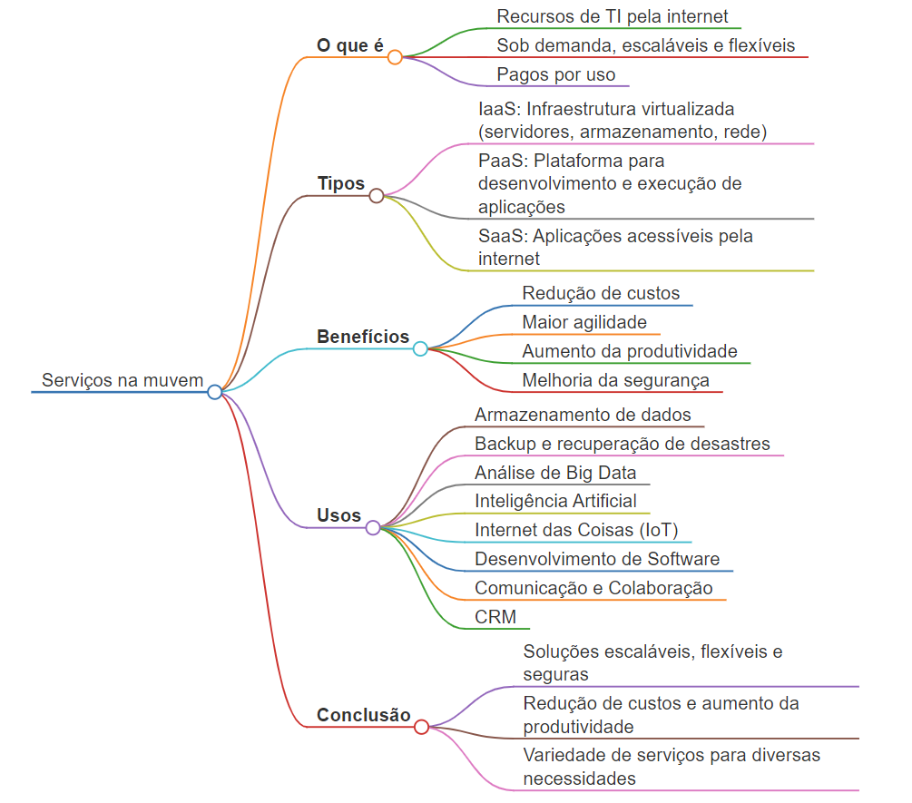

# Serviços na Nuvem - Usos e Benefícios

## **O que são?**

* Recursos e funcionalidades de TI disponibilizados pela internet
* Acessíveis sob demanda
* Escaláveis e flexíveis
* Pagos por uso

## **Modelos de Serviço**

* **IaaS (Infraestrutura como Serviço)**
    * Fornece infraestrutura de TI virtualizada
    * Servidores, armazenamento, rede
    * Ex: Amazon EC2, Microsoft Azure Virtual Machines
* **PaaS (Plataforma como Serviço)**
    * Ambiente para desenvolvimento e execução de aplicações
    * Sem necessidade de gerenciar infraestrutura
    * Ex: Google App Engine, Heroku
* **SaaS (Software como Serviço)**
    * Aplicações acessíveis pela internet
    * Sem necessidade de instalação ou atualização
    * Ex: Gmail, Office 365, Salesforce

## **Benefícios**

* **Redução de custos**
    * Elimina a necessidade de investimento em hardware e software
    * Pague apenas pelos recursos que usar
* **Maior agilidade**
    * Provisionamento rápido de recursos
    * Escalabilidade instantânea
* **Aumento da produtividade**
    * Acesso aos dados e aplicativos de qualquer lugar
    * Colaboração em tempo real
* **Melhoria da segurança**
    * Proteção de dados robusta
    * Monitoramento e detecção de ameaças

## **Exemplos de Uso**

* **Armazenamento de dados**
    * Dropbox, Google Drive, OneDrive
* **Backup e recuperação de desastres**
    * Veeam Cloud Backup, AWS Cloud Disaster Recovery
* **Análise de Big Data**
    * Amazon Redshift, Azure Data Lake Storage
* **Inteligência Artificial**
    * Google Cloud AI Platform, IBM Watson
* **Internet das Coisas (IoT)**
    * AWS IoT Core, Azure IoT Hub
* **Desenvolvimento de Software**
    * GitHub, GitLab
* **Comunicação e Colaboração**
    * Slack, Microsoft Teams
* **CRM (Gerenciamento de Relacionamento com o Cliente)**
    * Salesforce, HubSpot

## Mapa mental

## **Conclusão**

* Os serviços na nuvem oferecem uma ampla gama de benefícios para empresas e indivíduos. 
* São escaláveis, flexíveis, seguros e podem ajudar a reduzir custos e aumentar a produtividade. 
* Com a variedade de serviços disponíveis, é possível encontrar a solução perfeita para qualquer necessidade.
