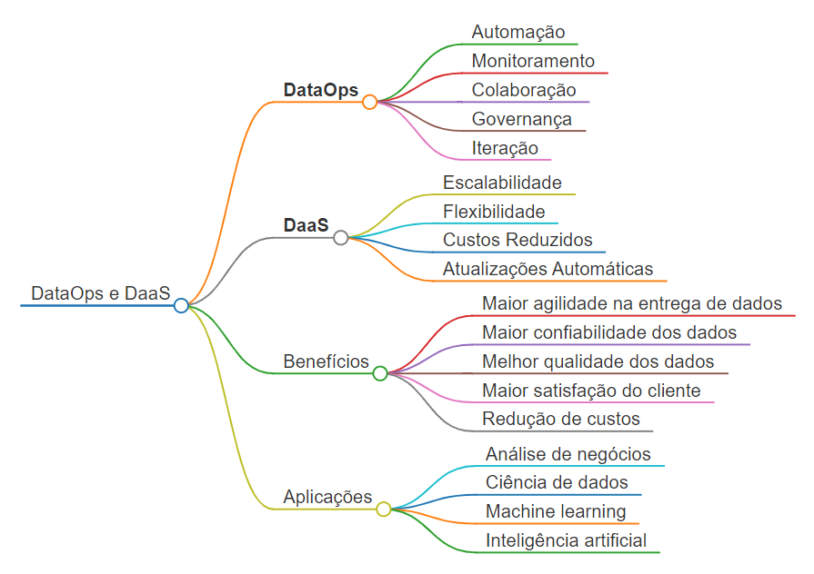

# DataOps e DaaS: Uma Abordagem Colaborativa para Dados como Serviço

## **DataOps**

O DataOps surge como uma disciplina inovadora, inspirada nos princípios do DevOps, para otimizar o gerenciamento de dados no contexto do DaaS (Data as a Service). Seu objetivo central é garantir a entrega contínua de dados precisos, confiáveis e de alta qualidade para os consumidores, impulsionando a agilidade e a confiabilidade no ciclo de vida dos dados.

### Princípios Fundamentais do DataOps

* **Automação:** Automatizar tarefas repetitivas e manuais, liberando tempo para atividades estratégicas e de maior valor.
* **Monitoramento:** Monitorar continuamente o pipeline de dados para detectar e resolver problemas de forma proativa.
* **Colaboração:** Promover a colaboração entre equipes de desenvolvimento, operações, ciência de dados e negócios para garantir alinhamento e eficiência.
* **Governança:** Implementar políticas e procedimentos robustos para garantir a segurança, a qualidade e a conformidade dos dados.
* **Iteração:** Adotar uma cultura de iteração contínua, aprendendo com os feedbacks e aprimorando os processos de forma incremental.

## **DaaS**

O DaaS (Data as a Service) se configura como um modelo de entrega de dados sob demanda, similar ao SaaS (Software as a Service), onde os dados são hospedados e gerenciados em um ambiente de nuvem, acessíveis aos usuários através da internet. O DaaS oferece diversas vantagens, como:

* **Escalabilidade:** Capacidade de escalar a infraestrutura de dados para atender às demandas em constante mudança.
* **Flexibilidade:** Acesso aos dados de qualquer lugar e a qualquer momento, através de diversos dispositivos.
* **Custos reduzidos:** Eliminação da necessidade de investir em infraestrutura física e equipe de TI dedicada.
* **Atualizações automáticas:** Garantia de que os usuários sempre estejam acessando a versão mais recente dos dados.

## Interligação entre DataOps e DaaS

O DataOps e o DaaS se complementam de forma sinérgica para oferecer uma solução completa para o gerenciamento de dados:

* **DataOps garante a qualidade e confiabilidade dos dados fornecidos no modelo DaaS.**
* **DaaS fornece a infraestrutura escalável e flexível para armazenar, processar e distribuir dados de acordo com as necessidades do DataOps.**

## **Mapa Mental**

## Observações

* O mapa mental é apenas um exemplo, podendo ser adaptado de acordo com suas necessidades específicas.
* É importante destacar que a implementação bem-sucedida do DataOps e DaaS exige planejamento cuidadoso, expertise técnica e colaboração entre as partes interessadas.

## Conclusão

Ao combinar os princípios do DataOps com a flexibilidade do DaaS, as empresas podem desbloquear o valor total de seus dados, impulsionando a inovação, a tomada de decisões inteligentes e o crescimento sustentável.
