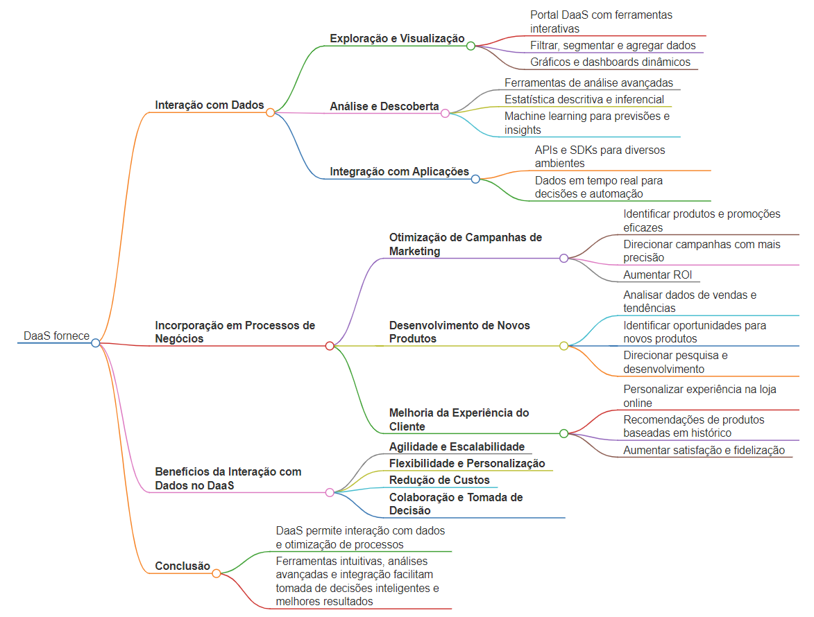

# Demonstração de Interação com Dados no DaaS e Incorporação em Aplicações e Processos de Negócios

## Cenário

Uma empresa de varejo online deseja analisar dados de vendas para identificar tendências de compra e otimizar campanhas de marketing. O DaaS fornece acesso a um conjunto de dados históricos de vendas e transações de clientes.

## Interação com Dados

### **Exploração e Visualização** 
* O usuário acessa o portal do DaaS e utiliza ferramentas interativas para explorar os dados de vendas.
* Ele pode filtrar, segmentar e agregar os dados de acordo com diferentes critérios, como data, produto, localização e canal de venda.
* Gráficos e dashboards dinâmicos permitem visualizar as tendências dos dados de forma rápida e intuitiva.

### **Análise e Descoberta**
* O usuário utiliza ferramentas de análise avançadas para identificar padrões e insights ocultos nos dados.
* Técnicas de estatística descritiva e inferencial são empregadas para analisar a correlação entre variáveis ​​e determinar a significância dos resultados.
* Algoritmos de machine learning podem ser utilizados para prever tendências futuras e identificar oportunidades de negócio.

### **Integração com Aplicações**
* Os dados do DaaS podem ser facilmente integrados com as aplicações existentes da empresa, como CRM, ERP e plataformas de BI.
* APIs e SDKs fornecem a flexibilidade para integrar os dados em diversos ambientes e fluxos de trabalho.
* Isso permite que os usuários utilizem os dados em tempo real para tomar decisões mais inteligentes e automatizar tarefas.

## Incorporação em Processos de Negócios

### **Otimização de Campanhas de Marketing:**
* Analisando dados de vendas e comportamento do cliente, a empresa pode identificar quais produtos e promoções são mais eficazes em diferentes segmentos de público.
* Essa informação pode ser utilizada para direcionar campanhas de marketing de forma mais precisa e aumentar o ROI.

### **Desenvolvimento de Novos Produtos:**
* A análise dos dados de vendas pode revelar oportunidades para o desenvolvimento de novos produtos ou serviços que atendam às necessidades e preferências dos clientes.
* Insights sobre tendências de mercado e lacunas na oferta podem direcionar a pesquisa e desenvolvimento de novos produtos inovadores.

### **Melhoria da Experiência do Cliente:**
* Os dados de vendas e transações podem ser utilizados para personalizar a experiência do cliente na loja online.
* Recomendações de produtos baseadas em histórico de compras e preferências podem aumentar a satisfação do cliente e fidelizá-lo.

## Benefícios da Interação com Dados no DaaS

* **Agilidade e Escalabilidade:** O DaaS oferece acesso rápido e escalável a grandes volumes de dados, permitindo análises complexas em tempo real.
* **Flexibilidade e Personalização:** O usuário tem autonomia para explorar e analisar os dados da forma que melhor atenda às suas necessidades específicas.
* **Redução de Custos:** O DaaS elimina a necessidade de investir em infraestrutura e hardware para armazenar e gerenciar dados, otimizando custos e recursos.
* **Colaboração e Tomada de Decisão:** O DaaS facilita a colaboração entre equipes e departamentos, permitindo a tomada de decisões mais informadas e estratégicas.
## Mapa mental

## Conclusão

O DaaS oferece uma forma poderosa e flexível para as empresas interagirem com seus dados e incorporá-los em seus processos de negócios. Através de ferramentas intuitivas, análises avançadas e integração com aplicações existentes, o DaaS permite que as empresas tomem decisões mais inteligentes, otimizem seus processos e alcancem melhores resultados.

---

[Home 🏠](../../README.md) | [Anotações](../anotacoes.md)