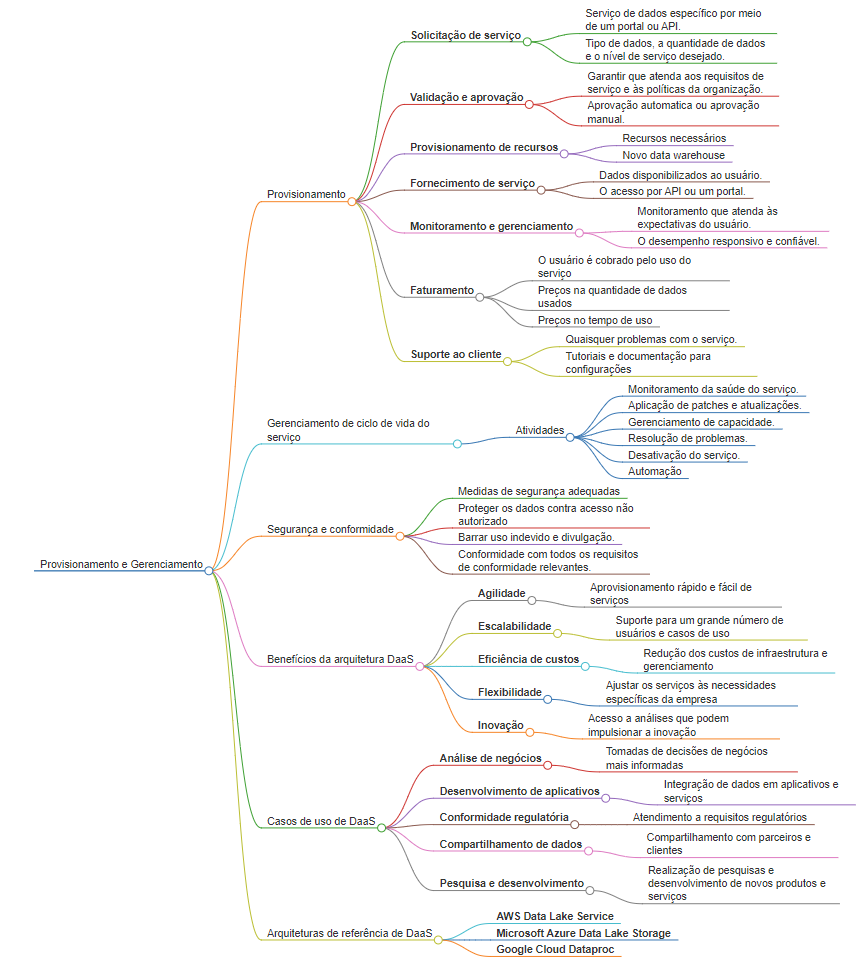

## Arquitetura de DaaS: Provisionamento e Gerenciamento de Serviços de Dados

A arquitetura de DaaS (Data as a Service) oferece um modelo de entrega de dados sob demanda, semelhante a outros serviços em nuvem como IaaS (Infrastructure as a Service) e PaaS (Platform as a Service). 

No DaaS, os dados residem em um data center centralizado e são disponibilizados aos consumidores por meio de uma interface de programação de aplicativos (API). Isso permite que as empresas acessem e utilizem dados sem precisar investir em infraestrutura e gerenciamento de dados próprios.

## O Processo de provisionamento 

O processo de provisionamento e gerenciamento de serviços de dados em uma arquitetura DaaS geralmente envolve as seguintes etapas:

### **Solicitação de serviço**

* O usuário solicita um serviço de dados específico por meio de um portal ou API.
* A solicitação inclui informações sobre o tipo de dados, a quantidade de dados e o nível de serviço desejado.

### **Validação e aprovação**

* A solicitação é validada para garantir que atenda aos requisitos de serviço e às políticas da organização.
* A solicitação pode ser aprovada automaticamente ou passar por um processo de aprovação manual.

### **Provisionamento de recursos**

* Os recursos necessários para atender à solicitação são provisionados.
* Isso pode incluir a criação de um novo data warehouse, a concessão de acesso aos dados e a configuração de permissões de segurança.

### **Fornecimento de serviço**

* O serviço de dados é provisionado e disponibilizado ao usuário.
* O usuário pode acessar os dados por meio de uma API ou de um portal.

### **Monitoramento e gerenciamento**

* O uso do serviço é monitorado para garantir que ele atenda às expectativas do usuário.
* O desempenho do serviço é gerenciado ativamente para garantir que ele seja responsivo e confiável.

### **Faturamento**

* O usuário é cobrado pelo uso do serviço de acordo com um modelo de preços predefinido.
* O modelo de preços pode ser baseado na quantidade de dados usados, no tempo de uso ou em outros fatores.

### **Suporte ao cliente**

* Suporte ao cliente é fornecido para auxiliar os usuários com quaisquer problemas que possam ter com o serviço.

## Gerenciamento de ciclo de vida do serviço

* A arquitetura DaaS também deve fornecer suporte para o gerenciamento do ciclo de vida do serviço de dados.
* Isso inclui atividades como:
    * Monitoramento da saúde do serviço
    * Aplicação de patches e atualizações
    * Gerenciamento de capacidade
    * Resolução de problemas
    * Desativação do serviço quando não for mais necessário

## Segurança e conformidade

* A segurança e a conformidade são aspectos importantes de qualquer arquitetura DaaS.
* A arquitetura deve implementar medidas de segurança adequadas para proteger os dados contra acesso não autorizado, uso indevido e divulgação.
* A arquitetura também deve estar em conformidade com todos os requisitos de conformidade relevantes.

## Benefícios da arquitetura DaaS

A arquitetura DaaS oferece vários benefícios às empresas, incluindo:

### **Agilidade** 
- Aprovisionamento rápido e fácil de serviços de dados
### **Escalabilidade** 
- Suporte para um grande número de usuários e casos de uso
### **Eficiência de custos** 
- Redução dos custos de infraestrutura e gerenciamento de dados
### **Flexibilidade** 
- Capacidade de ajustar os serviços de dados às necessidades específicas da empresa
### **Inovação** 
- Acesso a novos dados e análises que podem impulsionar a inovação

## Casos de uso de DaaS

A arquitetura DaaS pode ser usada para uma variedade de casos de uso, incluindo:

### **Análise de negócios** 
- Acesso e análise de dados para tomar decisões de negócios mais informadas
### **Desenvolvimento de aplicativos** 
- Integração de dados em aplicativos e serviços
### **Conformidade regulatória** 
- Atendimento a requisitos regulatórios por meio de relatórios e análises de dados
### **Compartilhamento de dados** 
- Compartilhamento seguro de dados com parceiros e clientes
### **Pesquisa e desenvolvimento** 
- Realização de pesquisas e desenvolvimento de novos produtos e serviços

## Arquiteturas de referência de DaaS

Vários fornecedores de tecnologia oferecem arquiteturas de referência de DaaS que podem ser usadas para implementar uma solução DaaS. 

Algumas das arquiteturas de referência mais populares incluem:

### **AWS Data Lake Service** 
- Um serviço totalmente gerenciado para armazenar e analisar dados em formato de lago de dados.
### **Microsoft Azure Data Lake Storage** 
- Um serviço de armazenamento escalável e seguro para grandes conjuntos de dados não estruturados.
### **Google Cloud Dataproc** 
- Um serviço de gerenciamento de cluster Apache Hadoop e Spark para análise de big data

## Mapa mental

---

[Home 🏠](../../README.md) | [Anotações](../anotacoes.md)