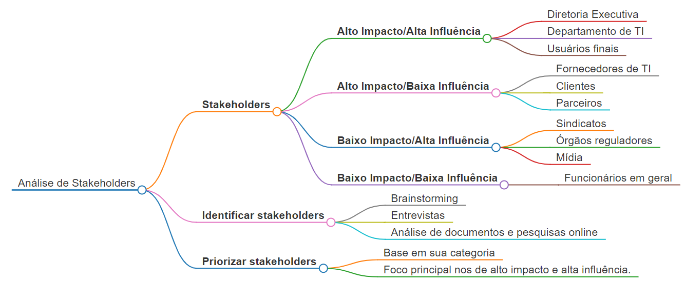
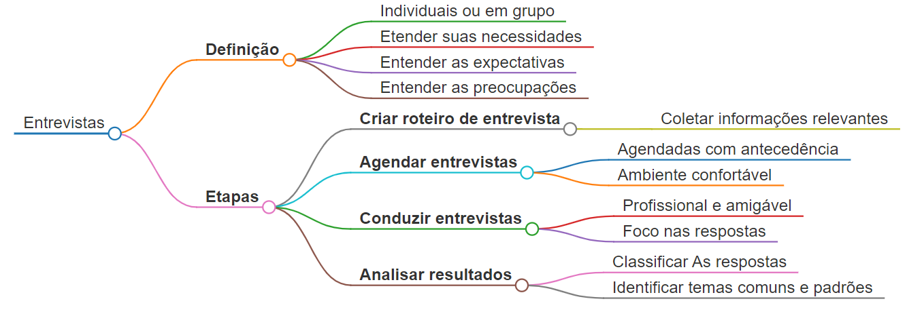
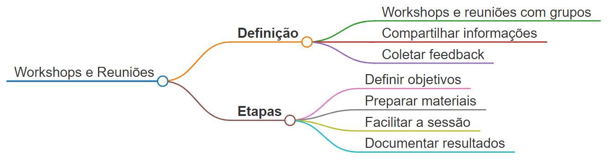
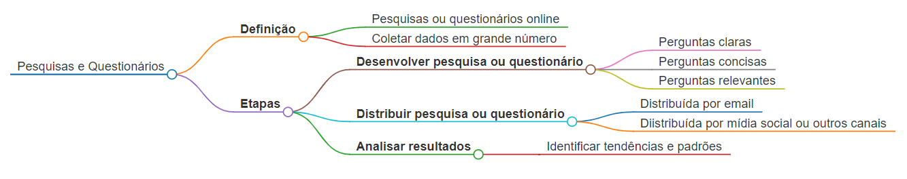
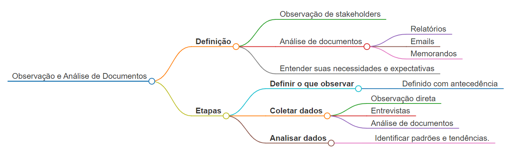
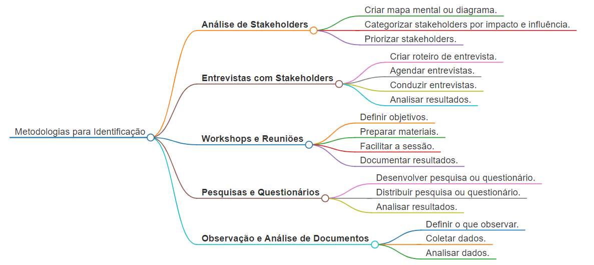

# Identificação de Stakeholders na Implementação de DaaS

A identificação das partes interessadas (stakeholders) é crucial para o sucesso da implementação de um Data as a Service (DaaS) em uma organização. Ao envolver os stakeholders certos no processo, é possível garantir que o projeto atenda às suas necessidades e expectativas, minimizar a resistência à mudança e aumentar as chances de adoção bem-sucedida.

## **Metodologias Recomendadas**

### **1. Análise de Stakeholders**

* **Definição** 
    Essa metodologia envolve a criação de um mapa mental ou diagrama para identificar e categorizar os stakeholders de acordo com seu nível de influência, interesse e impacto no projeto.

* **Etapas**
    1. **Identificar stakeholders** 
        Brainstorming, entrevistas, análise de documentos e pesquisas online são técnicas utilizadas para identificar todos os stakeholders relevantes.
    2. **Categorizar stakeholders** 
        Os stakeholders são categorizados em grupos com base em seu nível de influência, interesse e impacto no projeto.
        * **Alto impacto/alta influência** 
            São stakeholders com grande poder de decisão e podem bloquear o projeto se não estiverem satisfeitos.
        * **Alto impacto/baixa influência** 
            São stakeholders que podem ser impactados pelo projeto, mas não possuem grande poder de decisão.
        * **Baixo impacto/alta influência** 
            São stakeholders que podem influenciar o projeto, mas não serão diretamente impactados por ele.
        * **Baixo impacto/baixa influência** 
            São stakeholders que não possuem grande poder de decisão e não serão diretamente impactados pelo projeto.
    1. **Priorizar stakeholders** 
        Os stakeholders são priorizados com base em sua categoria, com foco principal nos stakeholders de alto impacto e alta influência.

#### Mapa mental

### **2. Entrevistas com Stakeholders**

* **Definição** 
    Essa metodologia envolve a realização de entrevistas individuais ou em grupo com os stakeholders para entender suas necessidades, expectativas e preocupações em relação ao projeto DaaS.
* **Etapas**

    1. **Criar roteiro de entrevista** 
        Um roteiro de entrevista deve ser elaborado para garantir que todas as informações relevantes sejam coletadas.
    2. **Agendar entrevistas** 
        As entrevistas devem ser agendadas com antecedência e realizadas em um ambiente confortável para os stakeholders.
    3. **Conduzir entrevistas** 
        As entrevistas devem ser conduzidas de forma profissional e amigável, com foco em ouvir atentamente as respostas dos stakeholders.
    4. **Analisar resultados** 
        As respostas das entrevistas devem ser analisadas para identificar temas comuns e padrões.

#### Mapa mental

### **3. Workshops e Reuniões**

* **Definição** 
    Essa metodologia envolve a realização de workshops e reuniões com grupos de stakeholders para discutir o projeto DaaS, compartilhar informações e coletar feedback.

* **Etapas**

    1. **Definir objetivos** 
        Os objetivos do workshop ou reunião devem ser claramente definidos com antecedência.

    2. **Preparar materiais** 

        Materiais de apresentação e outros recursos devem ser preparados para facilitar a discussão.

    3. **Facilitar a sessão** 

        A sessão deve ser facilitada por um profissional experiente que possa manter a discussão no foco e garantir que todos os stakeholders tenham a oportunidade de participar.

    4. **Documentar resultados** 

        Os resultados da sessão devem ser documentados para uso futuro.

#### Mapa mental

### **4. Pesquisas e Questionários**

* **Definição** 

    Essa metodologia envolve a realização de pesquisas ou questionários online para coletar dados de um grande número de stakeholders.

* **Etapas**
    1. **Desenvolver pesquisa ou questionário** 

        A pesquisa ou questionário deve ser bem elaborado para garantir que as perguntas sejam claras, concisas e relevantes para o projeto DaaS.

    2. **Distribuir pesquisa ou questionário** 

        A pesquisa ou questionário pode ser distribuída por email, mídia social ou outros canais.

    3. **Analisar resultados** 

        Os resultados da pesquisa ou questionário devem ser analisados para identificar tendências e padrões.

#### Mapa mental

### **5. Observação e Análise de Documentos**

* **Definição** 

    Essa metodologia envolve a observação de stakeholders em seu ambiente de trabalho e a análise de documentos como relatórios, emails e memorandos para entender suas necessidades e expectativas.

* **Etapas**

    1. **Definir o que observar** 

        O que se deseja observar deve ser claramente definido com antecedência.

    2. **Coletar dados** 

        Os dados podem ser coletados através de observação direta, entrevistas ou análise de documentos.

    3. **Analisar dados** 

        Os dados coletados devem ser analisados para identificar padrões e tendências.

#### Mapa mental

## **Considerações Adicionais**

* **Comunicação** 

    É crucial manter uma comunicação clara e transparente com os stakeholders durante todo o processo de implementação do DaaS. Isso envolve:

    * Informá-los sobre o progresso do projeto.
    * Solicitar feedback e sugestões.
    * Abordar suas preocupações e responder às suas perguntas.

* **Gerenciamento de expectativas** 

    É importante definir expectativas realistas para o projeto DaaS e gerenciá-las ao longo do processo. Isso envolve:

    * Discutir os benefícios e os riscos do projeto com os stakeholders.
    * Definir metas e prazos claros.
    * Ser honesto sobre os desafios e potenciais obstáculos.

* **Engajamento contínuo** 

    É importante manter os stakeholders engajados no projeto DaaS mesmo após a implementação. Isso envolve:

    * Solicitar feedback contínuo sobre o desempenho do DaaS.
    * Oferecer treinamento e suporte aos usuários.
    * Manter o DaaS atualizado com as últimas tecnologias e necessidades do negócio.

**Ferramentas Úteis**

* **Softwares de gerenciamento de stakeholders** 

    Existem diversos softwares disponíveis que podem ajudar a gerenciar o processo de identificação, comunicação e engajamento de stakeholders.

* **Modelos e ferramentas online** 

    Diversos modelos e ferramentas online estão disponíveis para auxiliar na identificação e análise de stakeholders.

* **Consultores especializados** 

    Consultores especializados em gerenciamento de stakeholders podem fornecer orientação e suporte durante o processo de implementação do DaaS.

**Conclusão**

A identificação e o engajamento das partes interessadas certas são essenciais para o sucesso da implementação de um DaaS em uma organização. Ao seguir as metodologias e considerações descritas acima, as empresas podem aumentar as chances de adoção bem-sucedida do DaaS e maximizar o retorno do investimento.

**Lembre-se**

* Cada organização é única e a melhor metodologia para identificar stakeholders pode variar de acordo com o contexto específico.
* É importante ser flexível e adaptar a abordagem de acordo com as necessidades da organização e dos stakeholders.
* O sucesso da implementação do DaaS depende da colaboração e do trabalho em equipe de todos os stakeholders envolvidos.

## Mapa mental

