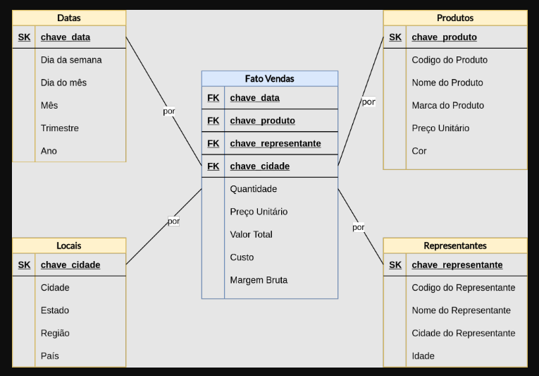
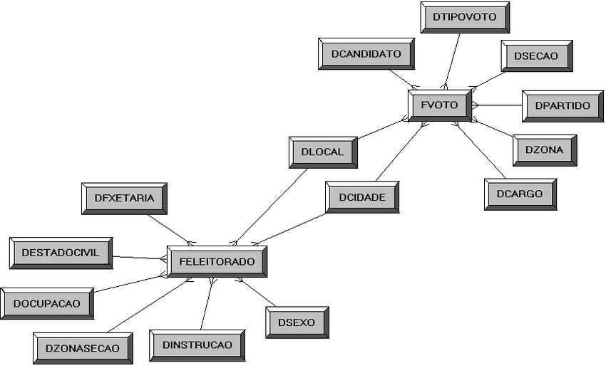

## O que é um Modelo Dimensional?

No contexto da modelagem de dados, um **modelo dimensional**, também conhecido como **modelo dimensional Kimball**, é uma técnica para organizar e estruturar dados em um data warehouse ou banco de dados. Essa organização facilita a análise e a obtenção de insights de negócios a partir dos dados.

Ao contrário dos modelos relacionais tradicionais, que se baseiam em entidades e relacionamentos entre elas, os modelos dimensionais se concentram em **fatos** e **dimensões**:

* **Fatos:** São as medidas quantificáveis de um processo de negócio. Por exemplo, o número de vendas em um determinado dia, a quantidade de produtos vendidos por loja ou o tempo médio de atendimento ao cliente.
* **Dimensões:** São os atributos que fornecem contexto aos fatos. Elas descrevem as características dos fatos e permitem que sejam analisados de diferentes perspectivas. Por exemplo, a data da venda, a loja onde a venda foi realizada, o produto vendido ou o cliente que fez a compra.

Os modelos dimensionais geralmente são estruturados em uma das seguintes formas:

* **Modelo em Estrela:** Uma tabela de fatos central está ligada a várias tabelas de dimensões por meio de chaves estrangeiras. Essa estrutura é simples e fácil de entender, mas pode ser menos eficiente para grandes volumes de dados.

* **Modelo em Floco de Neve:** As tabelas de dimensões estão relacionadas entre si, criando uma hierarquia. Essa estrutura é mais flexível e pode acomodar mais detalhes, mas também pode ser mais complexa de gerenciar.

## Benefícios da Modelagem Dimensional

A modelagem dimensional oferece diversos benefícios para a análise de dados:

* **Facilidade de uso:** A estrutura simples e intuitiva dos modelos dimensionais facilita a compreensão e o uso dos dados por usuários de negócios, mesmo aqueles sem conhecimento técnico aprofundado.
* **Análise multidimensional:** As dimensões permitem que os dados sejam analisados de diferentes perspectivas, revelando insights que não seriam possíveis com modelos de dados tradicionais.
* **Flexibilidade:** Os modelos dimensionais podem ser facilmente adaptados para acomodar novas fontes de dados e requisitos de negócios.
* **Desempenho:** A organização eficiente dos dados em modelos dimensionais pode melhorar o desempenho das consultas e análises.

## Exemplos de Uso da Modelagem Dimensional

A modelagem dimensional é utilizada em diversas áreas, como:

* **Varejo:** Análise de vendas por produto, loja, região e período de tempo.
* **Finanças:** Análise de receitas, despesas, lucros e investimentos por conta, departamento e período de tempo.
* **Marketing:** Análise de campanhas de marketing, canais de aquisição de clientes e comportamento do cliente.
* **Manufatura:** Análise da produção, estoque, qualidade e eficiência operacional por produto, fábrica e linha de produção.

## Considerações Finais

A modelagem dimensional é uma ferramenta poderosa para organizar e analisar dados em data warehouses e bancos de dados. Sua simplicidade, flexibilidade e capacidade de fornecer insights multidimensionais a tornam uma escolha popular para empresas que desejam obter mais valor de seus dados.

## **Lembre-se**

* A modelagem dimensional é apenas uma das técnicas de modelagem de dados disponíveis. A escolha da técnica mais adequada dependerá das necessidades específicas de cada projeto.
* É importante ter um bom entendimento do negócio e dos dados antes de iniciar a modelagem dimensional.
* A modelagem dimensional é um processo iterativo que pode precisar ser ajustado ao longo do tempo.

