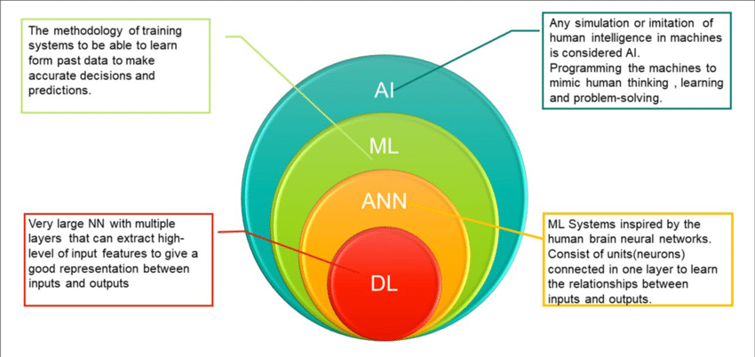

# Introdução a Machine Learning

## Introdução

### O que é Machine Learning?

Machine Learning (ML) é um subcampo da Inteligência Artificial (IA) que se concentra na construção de sistemas que aprendem com os dados. Em vez de serem explicitamente programados para realizar uma tarefa, os sistemas de ML usam algoritmos para identificar padrões em dados e fazer previsões ou tomar decisões.

**Como funciona o Machine Learning?**

1. **Coleta de dados:** Grandes conjuntos de dados são coletados e preparados para o treinamento.
2. **Treinamento do modelo:** Um algoritmo de ML é alimentado com os dados de treinamento para aprender padrões e relações.
3. **Avaliação do modelo:** O modelo treinado é testado em um conjunto de dados separado para avaliar sua precisão e desempenho.
4. **Otimização do modelo:** O modelo é ajustado e aprimorado com base nos resultados da avaliação.
5. **Previsões e decisões:** O modelo final é usado para fazer previsões ou tomar decisões sobre novos dados.

**Tipos de Machine Learning:**

* **Aprendizado supervisionado:** O algoritmo é treinado em dados rotulados, onde a saída desejada é conhecida.
* **Aprendizado não supervisionado:** O algoritmo aprende padrões em dados não rotulados, sem uma saída específica.
* **Aprendizado por reforço:** O algoritmo aprende por meio de tentativa e erro, recebendo recompensas por ações corretas.

**Aplicações do Machine Learning:**

* **Reconhecimento de imagem e fala:** Usado em assistentes virtuais, carros autônomos e diagnósticos médicos.
* **Processamento de linguagem natural:** Permite que computadores entendam e gerem linguagem humana, como em chatbots e tradutores.
* **Detecção de fraudes:** Identifica transações fraudulentas em bancos e sistemas de pagamento.
* **Recomendação de produtos:** Sugere produtos relevantes aos usuários em plataformas de e-commerce.
* **Previsão de demanda:** Auxilia empresas a prever a demanda por produtos e serviços.

**Exemplos de Machine Learning no dia a dia:**

* **Filtros de spam:** Classificam e-mails como spam ou não spam.
* **Recomendações de filmes e músicas:** Plataformas como Netflix e Spotify usam ML para recomendar conteúdo.
* **Pesquisa na web:** Mecanismos de busca usam ML para fornecer resultados relevantes.
* **Redes sociais:** Algoritmos de ML personalizam o feed de notícias e sugerem conexões.

O Machine Learning está transformando a maneira como interagimos com a tecnologia e o mundo ao nosso redor. Com o aumento da disponibilidade de dados e o avanço dos algoritmos, o ML continuará a desempenhar um papel fundamental em diversas áreas, impulsionando a inovação e a automação.

#### Analogia com o aprendizado humano

`"Aprender com a experiência para melhorar o desempenho em tarefas."`

Imagine que você é uma criança aprendendo a andar de bicicleta. No começo, você cai muito, não consegue se equilibrar e precisa de ajuda para se manter em pé. Mas, a cada tentativa, você aprende algo novo: como posicionar o corpo, como usar os pedais, como controlar o guidão. Com o tempo e a prática, você se torna mais habilidoso e confiante, até que consegue andar de bicicleta sem dificuldades.

O Machine Learning funciona de forma semelhante. Assim como você aprende a andar de bicicleta com a experiência, os algoritmos de Machine Learning aprendem com os dados. A cada novo dado que o algoritmo recebe, ele ajusta seus parâmetros internos para melhorar seu desempenho em uma determinada tarefa. 

**Analogia:**

* **Experiência (humano) = Dados (Machine Learning)**: Assim como nós aprendemos com nossas experiências, os algoritmos aprendem com os dados que recebem.
* **Melhorar o desempenho em tarefas (humano) = Melhorar a precisão em tarefas (Machine Learning)**: Nosso objetivo ao aprender é realizar tarefas com mais eficiência. O objetivo do Machine Learning é que os algoritmos se tornem mais precisos na realização de suas tarefas.
* **Cair da bicicleta (humano) = Erros nas previsões (Machine Learning)**: Assim como caímos da bicicleta enquanto aprendemos, os algoritmos também cometem erros no início. Esses erros são usados para ajustar o modelo e melhorar sua performance.

Em resumo, o Machine Learning é como um aprendiz que usa dados como experiência para aprimorar suas habilidades e realizar tarefas com cada vez mais precisão.

#### Diferenças entre Machine Learning, Inteligência Artificial e Deep Learning. 

É comum haver confusão entre esses termos, pois eles estão interligados. Para entender as diferenças, pense neles como um conjunto de bonecas russas:

* **Inteligência Artificial (IA)** é o conceito mais amplo. Refere-se à capacidade de uma máquina imitar a inteligência humana, como aprender, resolver problemas e tomar decisões. É o objetivo final.
* **Machine Learning (ML)** é uma forma de alcançar a IA.  São algoritmos que permitem que as máquinas aprendam com os dados sem serem explicitamente programadas. Em vez de seguir instruções passo-a-passo, o sistema identifica padrões nos dados e faz previsões.
* **Deep Learning (DL)** é uma subcategoria de Machine Learning que usa redes neurais artificiais com várias camadas (por isso "deep") para analisar dados de forma mais complexa. É inspirado no cérebro humano e permite que a máquina aprenda com grandes quantidades de dados, reconhecendo padrões complexos.

**Aqui vai uma analogia:** Imagine que você quer ensinar uma máquina a reconhecer gatos.

* **IA:** Seria o objetivo geral de criar uma máquina que reconheça gatos como um humano faria.
* **ML:** Seria usar um algoritmo que analisa fotos de gatos e cães, identificando características como orelhas pontudas, bigodes e formato do focinho para aprender a diferenciá-los.
* **DL:**  Seria usar uma rede neural com várias camadas para analisar as fotos, reconhecendo padrões complexos como a curvatura do corpo, a posição dos olhos e a textura da pelagem,  permitindo identificar até raças específicas de gatos.

**Em resumo:**

* IA é o conceito geral de máquinas inteligentes.
* ML é uma maneira de alcançar a IA, permitindo que as máquinas aprendam com os dados.
* DL é uma forma avançada de ML que usa redes neurais complexas para aprender com grandes quantidades de dados.

### Por que Machine Learning é importante?

    * Crescimento exponencial de dados.
    * Necessidade de automatizar tarefas complexas.
    * Aplicações em diversas áreas: saúde, finanças, marketing, segurança, etc.
    * Exemplos de aplicações: reconhecimento facial, carros autônomos, diagnóstico médico, recomendação de produtos.

* **Tipos de Aprendizado:**
    * Supervisionado: Treinar um modelo com dados rotulados (entrada e saída desejada).
        * Exemplos: classificação (spam/não spam), regressão (preço de imóveis).
    * Não supervisionado: Encontrar padrões em dados não rotulados.
        * Exemplos: clusterização (segmentação de clientes), redução de dimensionalidade.
    * Aprendizado por reforço: Aprender por tentativa e erro, recebendo recompensas ou penalidades.
        * Exemplos: jogos, robótica.

**Parte 2: Algoritmos básicos (45 minutos)**

* **Algoritmos de Classificação:**
    * K-Nearest Neighbors (KNN): Classificar um dado com base nos seus vizinhos mais próximos.
        * Demonstração de código: Classificação de flores Iris com KNN usando scikit-learn.
    * Árvores de Decisão: Criar um modelo de decisão em forma de árvore.
        * Exemplo: Árvore de decisão para aprovação de crédito.
    * Naive Bayes: Classificar com base no teorema de Bayes, assumindo independência entre as features.
        * Exemplo: Classificação de emails como spam ou não spam.
* **Algoritmos de Regressão:**
    * Regressão Linear: Modelar a relação entre variáveis com uma linha reta.
        * Demonstração de código: Previsão de preços de casas com regressão linear usando scikit-learn.

**Parte 3: Aplicações e desafios (30 minutos)**

* **Aplicações de Machine Learning em diferentes áreas:**
    * Saúde: Diagnóstico de doenças, descoberta de medicamentos.
    * Finanças: Previsão de mercado, detecção de fraudes.
    * Marketing: Segmentação de clientes, recomendação de produtos.
    * Indústria:  Manutenção preditiva, otimização de processos.
* **Desafios do Machine Learning:**
    * Qualidade dos dados: dados incompletos, ruidosos ou enviesados.
    * Overfitting: Modelo muito complexo que se ajusta demais aos dados de treinamento.
    * Underfitting: Modelo muito simples que não captura a complexidade dos dados.
    * Interpretabilidade: Dificuldade em entender como o modelo toma decisões.
    * Ética e viés: Garantir que os modelos sejam justos e não discriminatórios.

**Parte 4: Discussão e Próximos Passos (15 minutos)**

* Abertura para perguntas e debate sobre os temas abordados.
* Indicação de materiais complementares: livros, artigos, cursos online.
* Apresentação dos tópicos das próximas aulas.

**Dicas:**

* Utilize exemplos e analogias para facilitar a compreensão dos conceitos.
* Faça demonstrações de código simples e intuitivas.
* Incentive a participação dos alunos com perguntas e debates.
* Mostre exemplos de aplicações de Machine Learning que sejam relevantes para a área de Engenharia e Ciência de Dados.
* Contextualize os desafios do Machine Learning com exemplos reais.

**Material complementar:**

* [Livro] Introduction to Machine Learning with Python by Andreas C. Müller & Sarah Guido
* [Curso online] Machine Learning course by Andrew Ng on Coursera
* [Biblioteca] Scikit-learn documentation

Lembre-se de adaptar o conteúdo e a dinâmica da aula de acordo com o perfil da sua turma. Boa aula! 😊

-----

[🔙Voltar](../README.md)