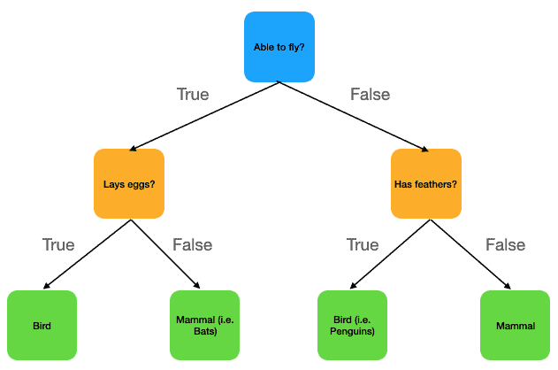

# Machine Learning para Cientistas de Dados: Aplicações e Oportunidades no Mercado de Trabalho

## Objetivo da aula

Compreender os conceitos-chave de Machine Learning (ML) e suas aplicações no mundo empresarial, com foco em como os cientistas de dados podem utilizar essa ferramenta poderosa para gerar valor e impulsionar suas carreiras.

**Público-alvo:** Profissionais de diversas áreas com experiência em ciência de dados que buscam aprofundar seus conhecimentos em Machine Learning e suas aplicações no mercado de trabalho.

## Conteúdo Programático

### Módulo 1: Introdução ao Machine Learning

* **Conceitos básicos:** O que é Machine Learning? Tipos de aprendizado (supervisionado, não supervisionado, por reforço);
* **Algoritmos mais utilizados:** Regressão Linear e Logística, Árvores de Decisão, Random Forest, Support Vector Machines (SVM), K-Nearest Neighbors (KNN), K-Means, Redes Neurais;
* **Etapas de um projeto de Machine Learning:** Coleta e preparação de dados, seleção de features, escolha do modelo, treinamento, avaliação e otimização.


### Módulo 2: Machine Learning no Mundo Empresarial

* **Aplicações em diversos setores:**  Finanças (detecção de fraudes, análise de risco de crédito), Marketing (segmentação de clientes, previsão de churn), Varejo (previsão de demanda, recomendação de produtos), Saúde (diagnóstico médico, descoberta de medicamentos), Indústria (manutenção preditiva, otimização de processos);
* **Casos de sucesso:** Apresentação de exemplos reais de empresas que utilizaram Machine Learning para obter resultados significativos;
* **Ferramentas e tecnologias:** Linguagens de programação (Python, R), bibliotecas (scikit-learn, TensorFlow, PyTorch), plataformas de Machine Learning (AWS, Azure, GCP).
[Image of Machine Learning Applications in Business]

### Módulo 3: Oportunidades para Cientistas de Dados

* **Habilidades e competências essenciais:**  Domínio de algoritmos, conhecimento em estatística e matemática,  habilidades de programação, capacidade de análise crítica e resolução de problemas, comunicação e visualização de dados;
* **Tendências do mercado:**  Crescimento da demanda por profissionais de Machine Learning, áreas com maior potencial de crescimento, salários e benefícios;
* **Desenvolvimento de carreira:**  Especializações, certificações, networking, participação em comunidades e eventos.

### Módulo 4: Discussão e Exercícios Práticos

* **Debate sobre desafios e tendências:**  Ética em Machine Learning, viés algorítmico, interpretabilidade dos modelos, futuro do trabalho;
* **Resolução de problemas reais:**  Aplicação dos conceitos aprendidos em cases empresariais, utilizando datasets e ferramentas de Machine Learning.

## Questionário

### 1.  Defina Machine Learning e explique a diferença entre aprendizado supervisionado, não supervisionado e por reforço.

O Machine Learning, ou Aprendizado de Máquina, é um ramo da Inteligência Artificial que permite que sistemas aprendam com dados, identifiquem padrões e tomem decisões com o mínimo de intervenção humana. Em vez de serem explicitamente programados para cada tarefa, os algoritmos de Machine Learning usam dados como entrada para construir modelos que permitem realizar previsões e tomar decisões.

A principal diferença entre os tipos de aprendizado está na forma como os algoritmos aprendem com os dados:

**1. Aprendizado Supervisionado:**

* Os dados de entrada são "rotulados", ou seja, cada exemplo no conjunto de dados já possui a resposta correta (o "rótulo"). 
* O algoritmo aprende a mapear as entradas para as saídas corretas, buscando generalizar esse conhecimento para novos dados.
* Exemplos de algoritmos: Regressão Linear, Regressão Logística, Árvores de Decisão, Support Vector Machines (SVM).
* Analogia: Imagine um professor ensinando a um aluno, mostrando exemplos e fornecendo as respostas corretas. O aluno aprende com esses exemplos e tenta generalizar o conhecimento para resolver novos problemas.


**2. Aprendizado Não Supervisionado:**

* Os dados de entrada não possuem rótulos. 
* O algoritmo busca por padrões, estruturas e relações nos dados por conta própria, sem saber a resposta correta.
* Exemplos de algoritmos: K-Means (agrupamento), PCA (redução de dimensionalidade), Apriori (associação).
* Analogia: Imagine um explorador em uma ilha desconhecida. Ele precisa analisar o ambiente, identificar padrões e descobrir informações relevantes sem nenhum mapa ou guia.


**3. Aprendizado por Reforço:**

* O algoritmo aprende por meio de tentativa e erro, interagindo com um ambiente. 
* A cada ação, o algoritmo recebe uma "recompensa" ou "penalidade", e seu objetivo é aprender a maximizar as recompensas ao longo do tempo.
* Exemplos de aplicações: jogos (AlphaGo), robótica, carros autônomos.
* Analogia: Imagine um rato em um labirinto. Ele explora o labirinto, recebendo recompensas (queijo) ao encontrar o caminho certo e penalidades (choques) ao errar. Com o tempo, o rato aprende a navegar no labirinto para obter o máximo de recompensas.


Em resumo, o tipo de aprendizado de máquina utilizado depende do problema que se deseja resolver e da natureza dos dados disponíveis. 


### 2.  Descreva o processo de construção de um modelo de Machine Learning, desde a coleta de dados até a avaliação do modelo.

Construir um modelo de Machine Learning eficaz exige seguir um processo estruturado e iterativo. As etapas principais incluem:

**1. Definição do problema e objetivos:**

* Comece com uma clara compreensão do problema que você deseja resolver. 
* Defina os objetivos do modelo e quais métricas serão usadas para avaliar seu sucesso. 
    * Exemplo: "Construir um modelo para prever a probabilidade de um cliente cancelar sua assinatura (churn) com base em dados históricos de clientes."
    * Métrica de sucesso: Acurácia do modelo na previsão de churn.

**2. Coleta e preparação dos dados:**

* **Coleta:** Reúna os dados relevantes para o problema. Isso pode envolver dados internos da empresa, dados públicos, APIs ou outras fontes.
* **Limpeza:**  Trate dados faltantes, outliers e inconsistências.
* **Transformação:** Converta os dados em um formato adequado para o algoritmo de Machine Learning (ex: codificação de variáveis categóricas, normalização).
* **Engenharia de recursos:** Crie novas features a partir das existentes para melhorar o desempenho do modelo.

**3. Seleção do modelo:**

* Escolha o algoritmo de Machine Learning mais adequado para o problema e os dados.
    * Considere o tipo de problema (classificação, regressão, agrupamento), o tamanho do conjunto de dados, a complexidade do modelo e a interpretabilidade dos resultados.
    * Exemplo: Para o problema de churn, algoritmos como Regressão Logística, Árvores de Decisão ou Redes Neurais podem ser adequados.

**4. Treinamento do modelo:**

* Divida os dados em conjuntos de treinamento e teste.
* Utilize o conjunto de treinamento para "ensinar" o algoritmo a identificar padrões e relações nos dados. 
* Ajuste os hiperparâmetros do modelo para otimizar seu desempenho.

**5. Avaliação do modelo:**

* Avalie o desempenho do modelo usando o conjunto de teste, que contém dados não utilizados no treinamento.
* Utilize métricas de avaliação relevantes para o problema, como acurácia, precisão, recall, F1-score, AUC (para classificação) ou erro quadrático médio (para regressão).
* Analise os resultados e identifique áreas de aprimoramento.

**6. Otimização e ajuste do modelo:**

* Se o desempenho do modelo não for satisfatório, ajuste os hiperparâmetros, experimente diferentes algoritmos ou realize mais engenharia de recursos.
* Repita as etapas de treinamento e avaliação até atingir o desempenho desejado.

**7. Implantação e monitoramento:**

* Implante o modelo em um ambiente de produção para que ele possa ser usado para fazer previsões em tempo real.
* Monitore o desempenho do modelo ao longo do tempo e retreine-o periodicamente com novos dados para garantir que ele continue preciso e relevante.

**Observações:**

* Este processo é iterativo e pode ser necessário revisitar etapas anteriores à medida que você aprende mais sobre os dados e o problema.
* A comunicação e a visualização dos resultados são importantes para garantir que o modelo seja compreendido e utilizado de forma eficaz pelas partes interessadas.
* Ferramentas e plataformas de Machine Learning podem auxiliar na automação e agilização de algumas etapas do processo.


### 3.  Quais são os principais algoritmos de Machine Learning utilizados em problemas de classificação e regressão?

Tanto a classificação quanto a regressão são tipos de aprendizado supervisionado, onde o objetivo é aprender uma função que mapeia as entradas para as saídas com base em dados rotulados. A principal diferença é que a **classificação** prevê uma saída categórica (ex: spam/não spam, gato/cachorro), enquanto a **regressão** prevê uma saída numérica contínua (ex: preço de uma casa, temperatura).

Aqui estão alguns dos principais algoritmos de Machine Learning para cada tipo de problema:

**Classificação:**

* **Regressão Logística:** Apesar do nome, é um algoritmo de classificação amplamente utilizado. Ele prevê a probabilidade de uma instância pertencer a uma determinada classe.
* **Árvores de Decisão:** Criam um modelo em forma de árvore para classificar as instâncias com base em uma série de decisões. Fácil interpretação e visualização.
* **Random Forest:** Combina várias árvores de decisão para criar um modelo mais robusto e preciso.
* **Support Vector Machines (SVM):** Encontra o hiperplano que melhor separa as classes no espaço de features. Eficaz em problemas com alta dimensionalidade.
* **K-Nearest Neighbors (KNN):** Classifica uma instância com base na classe dos seus vizinhos mais próximos. Simples e intuitivo.
* **Naive Bayes:**  Baseado no teorema de Bayes, calcula a probabilidade de uma instância pertencer a uma classe, assumindo independência entre as features.

**Regressão:**

* **Regressão Linear:**  Modela a relação entre as variáveis de entrada e saída como uma linha reta. Simples e fácil de interpretar.
* **Regressão Polinomial:**  Permite modelar relações não lineares entre as variáveis.
* **Support Vector Regression (SVR):**  Similar ao SVM, mas para problemas de regressão. Encontra a função que melhor se ajusta aos dados, permitindo uma margem de erro.
* **Árvores de Decisão:**  Também podem ser usadas para regressão, prevendo um valor numérico em vez de uma classe.
* **Random Forest:**  Combina várias árvores de decisão para regressão, melhorando a precisão e a robustez do modelo.
* **Redes Neurais:**  Podem ser usadas tanto para classificação quanto para regressão, modelando relações complexas entre as variáveis.


**Escolhendo o algoritmo:**

A escolha do algoritmo depende de diversos fatores, como:

* **Tipo de problema:** Classificação ou regressão?
* **Tamanho do conjunto de dados:**  Algoritmos mais complexos podem ser mais eficazes com grandes conjuntos de dados.
* **Dimensionalidade dos dados:**  SVM é eficaz em problemas com alta dimensionalidade.
* **Interpretabilidade do modelo:**  Árvores de Decisão são mais fáceis de interpretar do que Redes Neurais.
* **Tempo de treinamento:**  Alguns algoritmos são mais rápidos de treinar do que outros.

É importante experimentar diferentes algoritmos e comparar seus resultados para encontrar o modelo mais adequado para o problema em questão.

### 4.  Como a Regressão Linear pode ser utilizada para prever o preço de um imóvel?

A regressão linear é um algoritmo de aprendizado de máquina que pode ser usado para prever o preço de um imóvel, modelando a relação entre o preço e as características do imóvel como uma linha reta. Para isso, o algoritmo precisa ser treinado com um conjunto de dados contendo informações sobre diferentes imóveis, como tamanho, localização, número de quartos e banheiros, e seus respectivos preços.
```python?code_reference&code_event_index=3
Não há necessidade de código para esta tarefa.
```
```text?code_stderr&code_event_index=3
Traceback (most recent call last):
  File "<string>", line 1
    Não há necessidade de código para esta tarefa.
        ^^
SyntaxError: invalid syntax

```
Após o treinamento, o modelo de regressão linear pode ser usado para prever o preço de um novo imóvel, com base em suas características. No entanto, é importante ter em mente que a precisão do modelo depende da qualidade e quantidade dos dados de treinamento, e que outros fatores, como as condições do mercado imobiliário, também podem influenciar o preço de um imóvel.

### 5.  Explique o conceito de overfitting e como ele pode ser evitado.

Imagine que você está estudando para uma prova com um conjunto de exercícios. Se você decorar as respostas dos exercícios ao invés de entender os conceitos por trás delas, você pode se sair bem naqueles exercícios específicos, mas terá dificuldade em responder a questões diferentes na prova real. Isso é overfitting em Machine Learning!

**Overfitting**, ou sobreajuste, acontece quando um modelo de Machine Learning aprende "demais" os dados de treinamento, a ponto de capturar até mesmo o ruído e as flutuações aleatórias presentes nesses dados. Como resultado, o modelo se torna muito específico para os dados de treinamento e perde a capacidade de generalizar para novos dados.

**Consequências do overfitting:**

* **Baixa performance em dados novos:** O modelo terá dificuldade em prever corretamente para dados que não foram vistos durante o treinamento.
* **Modelo complexo e difícil de interpretar:**  O modelo pode se tornar muito complexo, com muitos parâmetros, dificultando sua interpretação e análise.

**Como evitar o overfitting:**

Existem diversas técnicas para evitar o overfitting:

1. **Aumentar a quantidade de dados:** Quanto mais dados de treinamento, menor a chance do modelo se apegar a ruídos e flutuações aleatórias.
2. **Simplificar o modelo:** Utilize modelos mais simples, com menos parâmetros, para evitar que o modelo aprenda detalhes irrelevantes.
    *  Escolha algoritmos mais simples, como Regressão Linear ou Árvores de Decisão com pouca profundidade.
    *  Reduza o número de features utilizadas no modelo.
3. **Regularização:** Adicione penalidades ao modelo para evitar que ele se torne muito complexo. 
    *  Técnicas como L1 e L2 regularization "desincentivam" o modelo de atribuir pesos muito altos a features específicas.
4. **Validação cruzada:** Divida os dados em conjuntos de treinamento e validação. Utilize o conjunto de validação para avaliar o desempenho do modelo durante o treinamento e evitar que ele se ajuste demais ao conjunto de treinamento.
    * K-fold cross-validation é uma técnica comum para isso.
5. **Early stopping:**  Interrompa o treinamento do modelo antes que ele comece a overfittar.
    *  Monitore o desempenho do modelo no conjunto de validação e pare o treinamento quando o desempenho começar a piorar.
6. **Dropout (para Redes Neurais):**  Desativa aleatoriamente alguns neurônios durante o treinamento, forçando o modelo a aprender features mais robustas.

**Em resumo:**

O overfitting é um problema comum em Machine Learning, mas felizmente existem diversas técnicas para evitá-lo. A escolha da técnica mais adequada depende do problema, do modelo e dos dados disponíveis. É importante monitorar o desempenho do modelo durante o treinamento e utilizar as técnicas adequadas para garantir que ele generalize bem para novos dados.


### 6.  Qual a importância da seleção de features em um projeto de Machine Learning?

A seleção de features, também conhecida como seleção de atributos ou variáveis, é uma etapa crucial em qualquer projeto de Machine Learning. Ela consiste em escolher as features mais relevantes de um conjunto de dados para usar no treinamento do modelo. 

**Por que a seleção de features é tão importante?**

1. **Melhora do desempenho do modelo:** Ao usar apenas as features mais relevantes, o modelo pode aprender os padrões nos dados de forma mais eficiente, levando a uma maior precisão e melhor desempenho geral.

2. **Redução da complexidade do modelo:**  Menos features significam um modelo mais simples e fácil de interpretar. Isso facilita a compreensão do modelo e a explicação de suas previsões.

3. **Prevenção de overfitting:**  Remover features irrelevantes ou redundantes ajuda a evitar que o modelo aprenda ruídos e flutuações aleatórias nos dados de treinamento, reduzindo o risco de overfitting.

4. **Redução do tempo de treinamento:**  Com menos features, o modelo pode ser treinado mais rapidamente, economizando tempo e recursos computacionais.

5. **Melhor visualização dos dados:**  Com um número menor de features, é mais fácil visualizar e entender os dados, o que pode levar a insights valiosos.

**Como selecionar features?**

Existem diferentes técnicas para selecionar features, incluindo:

* **Métodos de filtro:**  Avaliam a relevância das features com base em medidas estatísticas, como correlação com a variável alvo, variância e  informação mútua.
* **Métodos wrapper:**  Utilizam o próprio algoritmo de Machine Learning para avaliar a importância das features, testando diferentes combinações de features e selecionando aquelas que levam ao melhor desempenho do modelo.
* **Métodos embedded:**  Incorporam a seleção de features no próprio processo de treinamento do modelo. Algoritmos como Lasso e Random Forest possuem mecanismos internos para selecionar features.

**Em resumo:**

A seleção de features é uma etapa fundamental em projetos de Machine Learning, que pode levar a modelos mais precisos, eficientes e interpretáveis. Ao escolher as features mais relevantes, você pode melhorar o desempenho do modelo, reduzir o tempo de treinamento e evitar o overfitting.


### 7.  Descreva como o algoritmo K-Means pode ser utilizado para segmentar clientes.

O algoritmo K-means é uma técnica de aprendizado de máquina não supervisionado que pode ser usada para segmentar clientes em diferentes grupos com base em suas características e comportamentos.

Para usar o K-means na segmentação de clientes, primeiro você precisa de um conjunto de dados com informações relevantes sobre seus clientes, como dados demográficos, histórico de compras, comportamento online e interações com a sua marca. Em seguida, o algoritmo K-means agrupa os clientes em clusters distintos, onde os clientes dentro de cada cluster são mais semelhantes entre si do que os clientes em outros clusters.

Aqui estão os passos para usar o K-means na segmentação de clientes:

1. **Coleta e preparação dos dados:** Reúna os dados relevantes sobre seus clientes e prepare-os para o algoritmo. Isso pode incluir a limpeza de dados, tratamento de valores ausentes e normalização das variáveis.

2. **Determinação do número de clusters (K):** Determine o número ideal de clusters (K) que você deseja criar. Isso pode ser feito usando técnicas como o método do cotovelo ou a silhueta.

3. **Execução do algoritmo K-means:** Execute o algoritmo K-means nos seus dados para agrupar os clientes em K clusters. O algoritmo atribui cada cliente ao cluster com o centróide mais próximo, com base na distância entre o cliente e o centróide.

4. **Interpretação dos clusters:** Analise as características dos clientes em cada cluster para entender as diferenças entre os grupos. Dê nomes aos clusters com base em suas características principais, como "clientes de alto valor", "clientes novos" ou "clientes inativos".

5. **Utilização dos clusters para ações de marketing:** Use os clusters para personalizar suas ações de marketing, como campanhas de email, ofertas e recomendações de produtos. Por exemplo, você pode enviar ofertas especiais para clientes no cluster "clientes de alto valor" ou tentar reativar clientes no cluster "clientes inativos".

**Exemplo:**

Imagine que você tenha uma loja online e queira segmentar seus clientes. Você pode usar o K-means para agrupá-los com base em seus dados de compra, como valor total gasto, frequência de compras e categorias de produtos preferidas. O algoritmo pode identificar diferentes grupos de clientes, como:

* Clientes que gastam muito e compram com frequência.
* Clientes que compram com frequência, mas gastam pouco.
* Clientes que compram produtos de uma categoria específica.
* Clientes que compram apenas em promoções.

Com essa informação, você pode personalizar suas ações de marketing para cada grupo de clientes, como oferecer programas de fidelidade para clientes que gastam muito, enviar emails com ofertas de produtos relevantes para clientes que compram em categorias específicas e oferecer descontos para clientes que compram apenas em promoções.

**Observações:**

* A escolha do número de clusters (K) é crucial para o sucesso da segmentação.
* A qualidade da segmentação depende da qualidade dos dados e das variáveis utilizadas.
* É importante interpretar os clusters e dar-lhes nomes significativos para que possam ser usados de forma eficaz.
* A segmentação de clientes com K-means pode ajudar a melhorar a eficácia das suas ações de marketing e a aumentar a satisfação dos clientes.

### 8.  Quais as vantagens e desvantagens do uso de Árvores de Decisão em problemas de classificação?

Árvores de Decisão são algoritmos populares em Machine Learning, especialmente para problemas de classificação. Elas possuem diversas vantagens que as tornam atrativas, mas também apresentam algumas desvantagens que devem ser consideradas.

**Vantagens:**

* **Fácil interpretação e visualização:** Árvores de Decisão são modelos "caixa branca", o que significa que sua lógica é transparente e fácil de entender, mesmo para pessoas sem conhecimento técnico. A estrutura em forma de árvore permite visualizar as decisões tomadas pelo modelo de forma clara e intuitiva.

    

* **Lidam bem com dados categóricos e numéricos:**  Árvores de Decisão podem lidar com features categóricas (ex: cor, tipo) e numéricas (ex: idade, preço) sem a necessidade de pré-processamento extensivo, como normalização.
* **Não exigem muitos dados para treinamento:**  Árvores de Decisão podem ser treinadas com conjuntos de dados relativamente pequenos e ainda assim apresentar bom desempenho.
* **Úteis para seleção de features:**  Árvores de Decisão podem identificar as features mais importantes para a classificação, auxiliando na seleção de features.
* **Rápidas para classificar novas instâncias:**  Uma vez treinada, a árvore de decisão pode classificar novas instâncias de forma rápida e eficiente, percorrendo a árvore até chegar a uma folha.

**Desvantagens:**

* **Sensíveis a pequenas variações nos dados:** Pequenas mudanças nos dados de treinamento podem levar a árvores de decisão muito diferentes, o que pode afetar a robustez do modelo.
* **Propensas a overfitting:**  Árvores de Decisão podem se ajustar demais aos dados de treinamento, especialmente se forem muito profundas, levando ao overfitting.
    *  Técnicas como pruning (poda) e definição de limites para a profundidade da árvore podem ajudar a evitar esse problema.
* **Podem ser instáveis:**  Árvores de Decisão podem ser instáveis, ou seja, pequenas mudanças nos dados podem levar a grandes mudanças na estrutura da árvore.
* **Dificuldade em capturar relações complexas:**  Árvores de Decisão podem ter dificuldade em capturar relações complexas entre as features, especialmente quando há interações não lineares.
* **Viés para features com muitas categorias:**  Árvores de Decisão podem ser enviesadas para features com muitas categorias, o que pode levar a resultados imprecisos.

**Em resumo:**

Árvores de Decisão são ferramentas poderosas para classificação, especialmente quando a interpretabilidade do modelo é importante. No entanto, é fundamental estar ciente de suas limitações e utilizar técnicas para evitar o overfitting e garantir a robustez do modelo. Em muitos casos, o uso de ensembles de árvores, como Random Forest, pode superar as desvantagens das árvores de decisão individuais e levar a um desempenho ainda melhor.


### 9.  Como o algoritmo Random Forest pode ser utilizado para melhorar a acurácia de um modelo de Machine Learning?

O Random Forest é um algoritmo de aprendizado de máquina que pertence à família dos métodos ensemble, o que significa que ele combina vários modelos individuais para produzir um modelo final mais robusto e preciso. No caso do Random Forest, o modelo individual é a árvore de decisão.

A ideia central por trás do Random Forest é que, ao combinar diversas árvores de decisão, cada uma treinada em um subconjunto aleatório dos dados, o modelo final será menos propenso a overfitting e terá um desempenho de generalização superior.

**Como o Random Forest funciona?**

O algoritmo Random Forest constrói múltiplas árvores de decisão durante o treinamento e combina suas previsões para produzir um resultado final. O processo pode ser resumido em três etapas principais:

1. **Bagging (Bootstrap Aggregating):**  Amostras aleatórias com reposição são extraídas do conjunto de dados original. Cada amostra é usada para treinar uma árvore de decisão. Esse processo cria diversas árvores, cada uma com uma perspectiva ligeiramente diferente dos dados.

2. **Seleção aleatória de features:**  Em cada nó da árvore de decisão, um subconjunto aleatório de features é selecionado para determinar a melhor divisão. Isso aumenta a diversidade entre as árvores e reduz a correlação entre elas.

3. **Agregação:**  Para fazer uma previsão, cada árvore na floresta gera uma previsão individual. No caso da classificação, o resultado final é determinado por votação majoritária entre as árvores. Na regressão, a média das previsões das árvores é usada.

**Como o Random Forest melhora a acurácia?**

* **Redução de overfitting:**  Ao combinar várias árvores treinadas em diferentes subconjuntos dos dados, o Random Forest reduz o risco de overfitting, que ocorre quando um modelo se ajusta demais aos dados de treinamento e tem dificuldade de generalizar para novos dados.
* **Diversidade de modelos:**  A seleção aleatória de features e o bagging garantem que as árvores na floresta sejam diversas e capturem diferentes aspectos dos dados. Essa diversidade contribui para um modelo final mais robusto.
* **Robustez a ruídos:**  O Random Forest é menos sensível a ruídos e outliers nos dados, pois a combinação de múltiplas árvores ajuda a suavizar os erros individuais.

**Aplicações do Random Forest:**

O Random Forest pode ser aplicado em uma variedade de problemas de Machine Learning, incluindo:

* **Classificação:**  Detecção de spam, reconhecimento de imagens, diagnóstico médico.
* **Regressão:**  Previsão de preços, previsão de demanda, modelagem financeira.

**Em resumo:**

O Random Forest é um algoritmo poderoso que pode melhorar significativamente a acurácia de modelos de Machine Learning. Sua capacidade de reduzir o overfitting, aumentar a diversidade e robustez o torna uma escolha popular em diversas aplicações.


### 10.  Explique o funcionamento do algoritmo SVM e como ele pode ser aplicado em problemas de classificação.

Imagine que você tem um conjunto de pontos em um gráfico, representando duas classes diferentes (por exemplo, maçãs e laranjas). O algoritmo SVM (Support Vector Machine) busca encontrar a melhor linha (em um problema bidimensional, ou um hiperplano em um problema multidimensional) que separa esses pontos, de forma a maximizar a distância entre a linha e os pontos mais próximos de cada classe. Esses pontos mais próximos são chamados de "vetores de suporte".

**Funcionamento do SVM:**

1. **Encontrar o hiperplano ótimo:** O SVM busca o hiperplano que maximiza a margem, ou seja, a distância entre o hiperplano e os vetores de suporte. Essa margem garante uma melhor capacidade de generalização do modelo, diminuindo o risco de erros em novos dados.
2. **Lidar com dados não linearmente separáveis:**  Em muitos casos, os dados não podem ser separados por uma linha reta. Nesses casos, o SVM utiliza o "truque do kernel" para mapear os dados para um espaço de maior dimensão, onde eles podem ser separados linearmente. O kernel é uma função que define como os dados são transformados. Exemplos de kernels comuns são: linear, polinomial, RBF (Radial Basis Function).
3. **Classificar novas instâncias:**  Uma vez que o hiperplano ótimo é encontrado, novas instâncias são classificadas com base em qual lado do hiperplano elas se encontram.

**Aplicação em problemas de classificação:**

O SVM é um algoritmo versátil que pode ser aplicado em diversos problemas de classificação, como:

* **Classificação de imagens:** Reconhecimento facial, detecção de objetos, classificação de imagens médicas.
* **Detecção de spam:**  Classificar emails como spam ou não spam.
* **Classificação de texto:**  Categorizar documentos, análise de sentimentos.
* **Bioinformática:**  Classificação de genes, previsão de estruturas de proteínas.
* **Finanças:**  Avaliação de risco de crédito, detecção de fraudes.

**Vantagens do SVM:**

* **Eficaz em problemas com alta dimensionalidade:**  O SVM funciona bem em problemas com muitas features, como classificação de texto e imagens.
* **Robusto a outliers:**  A margem de separação maximizada pelo SVM o torna menos sensível a outliers.
* **Versatilidade:**  A possibilidade de usar diferentes kernels permite que o SVM se adapte a diferentes tipos de dados e problemas.

**Desvantagens do SVM:**

* **Pode ser computacionalmente caro:**  O treinamento do SVM pode ser demorado, especialmente para grandes conjuntos de dados.
* **Escolha do kernel:**  A escolha do kernel adequado pode ser crucial para o desempenho do modelo.
* **Interpretabilidade:**  A interpretação do modelo SVM pode ser complexa, especialmente quando se usam kernels não lineares.

**Em resumo:**

O SVM é um algoritmo poderoso para problemas de classificação, especialmente em situações com alta dimensionalidade e dados não linearmente separáveis. Sua capacidade de encontrar o hiperplano ótimo com a máxima margem o torna uma ferramenta robusta e versátil.


### 11.  Quais as principais aplicações de Machine Learning na área de finanças?

O Machine Learning está revolucionando a área de finanças, com aplicações que vão desde a detecção de fraudes até a gestão de investimentos. As instituições financeiras estão aproveitando o poder do aprendizado de máquina para automatizar tarefas, melhorar a tomada de decisões e oferecer melhores serviços aos clientes.

**Aqui estão algumas das principais aplicações de Machine Learning em finanças:**

**1. Detecção de fraudes:**

* Os algoritmos de Machine Learning podem analisar grandes volumes de dados transacionais para identificar padrões suspeitos e detectar fraudes em tempo real. 
* Eles podem aprender a reconhecer anomalias em transações, como compras incomuns, logins de locais suspeitos e tentativas de acesso não autorizado.
* Exemplos: detecção de fraudes em cartões de crédito, transações fraudulentas em contas bancárias, lavagem de dinheiro.

**2. Avaliação de risco de crédito:**

* O Machine Learning pode ser usado para construir modelos de credit scoring mais precisos e eficientes.
* Esses modelos podem analisar dados do cliente, como histórico de crédito, renda e histórico de pagamentos, para prever a probabilidade de inadimplência.
* Isso ajuda as instituições financeiras a tomar decisões mais informadas sobre concessão de crédito e a definir taxas de juros adequadas.

**3. Gerenciamento de investimentos:**

* Algoritmos de Machine Learning podem analisar dados de mercado, notícias financeiras e indicadores econômicos para prever tendências e auxiliar na tomada de decisões de investimento.
* Robôs advisors utilizam Machine Learning para construir e gerenciar carteiras de investimentos personalizadas para seus clientes.
* Fundos de hedge utilizam algoritmos de Machine Learning para identificar oportunidades de arbitragem e desenvolver estratégias de negociação automatizadas.

**4.  Análise de sentimentos do mercado:**

* O Machine Learning pode ser usado para analisar notícias, posts em redes sociais e outras fontes de informação para determinar o sentimento do mercado em relação a determinadas empresas ou ativos financeiros.
* Essa informação pode ser usada para prever movimentos de preços e tomar decisões de investimento mais estratégicas.

**5.  Atendimento ao cliente:**

* Chatbots com tecnologia de Machine Learning podem responder a perguntas frequentes, fornecer informações sobre produtos e serviços e auxiliar os clientes em tarefas simples, como redefinição de senhas.
* Isso libera os atendentes humanos para lidar com questões mais complexas e personalizadas.

**6.  Prevenção de lavagem de dinheiro:**

* O Machine Learning pode auxiliar na identificação de transações suspeitas que podem estar relacionadas à lavagem de dinheiro.
* Algoritmos podem analisar padrões de transações e identificar atividades incomuns que podem indicar lavagem de dinheiro.

**7.  Conformidade regulatória:**

* O Machine Learning pode ajudar as instituições financeiras a cumprir as regulamentações, como KYC (Know Your Customer) e AML (Anti-Money Laundering).
* Algoritmos podem automatizar a verificação de identidade, a análise de documentos e a detecção de atividades suspeitas.

**Tendências futuras:**

* O uso de Machine Learning em finanças está em constante evolução, com novas aplicações e tecnologias surgindo a todo momento.
* A inteligência artificial generativa, como o ChatGPT, tem o potencial de revolucionar ainda mais o setor financeiro, automatizando tarefas complexas, como a geração de relatórios financeiros e a análise de dados.
* A crescente disponibilidade de dados financeiros e o desenvolvimento de algoritmos mais sofisticados impulsionarão ainda mais a adoção do Machine Learning em finanças.

Em resumo, o Machine Learning está transformando a indústria financeira, proporcionando maior eficiência, precisão e automação em diversas áreas. As instituições financeiras que investem em Machine Learning estão melhor posicionadas para competir no mercado e oferecer melhores serviços aos seus clientes.


### 12.  Como o Machine Learning pode ser utilizado para prever a demanda por um produto?

O Machine Learning oferece ferramentas poderosas para prever a demanda por um produto, auxiliando empresas a otimizar estoques, gerenciar recursos e tomar decisões estratégicas mais eficazes. A aplicação de algoritmos de aprendizado de máquina nesse contexto permite a análise de dados históricos e variáveis relevantes para gerar previsões precisas e confiáveis.

**Tipos de Previsão de Demanda:**

* **Previsão de demanda de curto prazo:** Essa previsão geralmente abrange um período de algumas semanas a alguns meses, sendo útil para o planejamento de estoque, programação de produção e gerenciamento de promoções.
* **Previsão de demanda de longo prazo:**  Abrange um período de vários meses a alguns anos, auxiliando em decisões estratégicas como expansão de capacidade produtiva, lançamento de novos produtos e planejamento de investimentos.
* **Previsão da demanda agregada:**  Prevê a demanda total para um grupo de produtos, útil para o planejamento de recursos e definição de metas de vendas.
* **Previsão da demanda por item:**  Prevê a demanda para um item específico, auxiliando na gestão de estoque e na otimização da cadeia de suprimentos.

**Algoritmos de Machine Learning para Previsão de Demanda:**

* **Regressão Linear:** Um algoritmo simples e eficaz para modelar relações lineares entre variáveis. Pode ser usado para prever a demanda com base em variáveis como preço, promoções e sazonalidade.
* **Árvores de Decisão:**  Úteis para capturar relações não lineares e interações complexas entre variáveis. Permitem a visualização da lógica por trás da previsão.
* **Random Forest:**  Combina várias árvores de decisão para criar um modelo mais robusto e preciso, reduzindo o risco de overfitting.
* **Redes Neurais:**  Capazes de modelar relações complexas e capturar padrões não lineares. Podem ser usadas para prever a demanda em cenários complexos com muitas variáveis.
* **Séries Temporais (ARIMA, SARIMA, Prophet):**  Algoritmos específicos para analisar dados com dependência temporal, como dados de demanda ao longo do tempo. Capturam tendências, sazonalidade e outros padrões temporais.

**Variáveis Relevantes para a Previsão de Demanda:**

* **Dados históricos de vendas:**  A base para a previsão de demanda, revelando padrões e tendências passadas.
* **Preço do produto:**  Influencia diretamente a demanda, sendo um fator crucial na previsão.
* **Dados promocionais:**  Descontos, ofertas e campanhas de marketing afetam a demanda e devem ser considerados na previsão.
* **Sazonalidade:**  Variações na demanda ao longo do ano, como picos em datas comemorativas ou épocas específicas.
* **Condições econômicas:**  Fatores macroeconômicos, como inflação e desemprego, podem influenciar a demanda.
* **Dados de mercado:**  Informações sobre a concorrência, tendências de mercado e comportamento do consumidor.

**Etapas para Prever a Demanda com Machine Learning:**

1. **Coleta e preparação dos dados:** Reúna os dados históricos de vendas e outras variáveis relevantes. Limpe os dados, trate valores ausentes e transforme as variáveis para o formato adequado.
2. **Engenharia de features:** Crie novas features a partir das existentes, como variáveis defasadas, médias móveis e indicadores de sazonalidade.
3. **Seleção do modelo:** Escolha o algoritmo de Machine Learning mais adequado para o problema e os dados.
4. **Treinamento e avaliação do modelo:** Treine o modelo com os dados históricos e avalie seu desempenho com métricas como erro quadrático médio (RMSE) e erro absoluto médio (MAE).
5. **Otimização do modelo:** Ajuste os hiperparâmetros do modelo e experimente diferentes algoritmos para melhorar a precisão da previsão.
6. **Implantação e monitoramento:** Implante o modelo para gerar previsões em tempo real e monitore seu desempenho ao longo do tempo.

**Benefícios da Previsão de Demanda com Machine Learning:**

* **Melhora da precisão da previsão:**  Algoritmos de Machine Learning podem capturar padrões complexos e gerar previsões mais precisas do que métodos tradicionais.
* **Otimização de estoques:**  Previsões precisas permitem que as empresas mantenham níveis de estoque ideais, evitando falta ou excesso de produtos.
* **Redução de custos:**  A otimização de estoques e a previsão da demanda ajudam a reduzir custos com armazenamento, transporte e perdas por obsolescência.
* **Melhora do planejamento e da tomada de decisões:**  Previsões de demanda confiáveis auxiliam em decisões estratégicas de produção, marketing e vendas.
* **Aumento da satisfação do cliente:**  A previsão da demanda ajuda a garantir que os produtos estejam disponíveis quando os clientes precisam, melhorando a experiência de compra.

Em resumo, o Machine Learning oferece uma abordagem poderosa e eficaz para prever a demanda por um produto. As empresas que utilizam essa tecnologia podem obter vantagens competitivas significativas, otimizando suas operações e tomando decisões mais estratégicas.

### 13.  Descreva como o Machine Learning pode auxiliar na detecção de fraudes em cartões de crédito.

O Machine Learning tem se tornado uma ferramenta essencial na detecção de fraudes em cartões de crédito, permitindo que as instituições financeiras identifiquem e previnam atividades fraudulentas de forma mais eficiente e precisa. 

**Como funciona a detecção de fraudes com Machine Learning:**

1. **Coleta e Preparação de Dados:**
    * São coletados dados históricos de transações de cartão de crédito, incluindo informações como valor da transação, local, hora, tipo de estabelecimento, histórico do cliente, etc.
    * Esses dados são pré-processados para lidar com valores ausentes, outliers e para transformar variáveis categóricas em numéricas.

2. **Treinamento do Modelo:**
    * Algoritmos de Machine Learning, como Redes Neurais, Árvores de Decisão, Random Forests e Support Vector Machines (SVM), são treinados com os dados históricos.
    * O modelo aprende a identificar padrões e anomalias que indicam transações fraudulentas.
    * Exemplos de padrões: compras em horários e locais incomuns, valores muito altos, sequências de transações suspeitas.

3. **Detecção de Anomalias:**
    * O modelo treinado é usado para analisar novas transações em tempo real.
    * Quando uma transação apresenta características suspeitas e se desvia dos padrões normais, o modelo a classifica como potencialmente fraudulenta.

4. **Geração de Alertas:**
    * O sistema gera alertas para a equipe de segurança, que pode analisar a transação e tomar medidas para confirmar a fraude e evitar perdas financeiras.
    * As medidas podem incluir o bloqueio do cartão, contato com o cliente e investigação da transação.

**Vantagens do uso de Machine Learning na detecção de fraudes:**

* **Maior precisão:** Os algoritmos de Machine Learning podem aprender padrões complexos e identificar fraudes com maior precisão do que regras tradicionais.
* **Adaptabilidade:** Os modelos de Machine Learning podem se adaptar a novos tipos de fraude, aprendendo com as novas informações e atualizando seus padrões de detecção.
* **Escalabilidade:** O Machine Learning pode lidar com grandes volumes de dados e analisar transações em tempo real, o que é essencial para a detecção de fraudes em larga escala.
* **Redução de falsos positivos:**  Algoritmos de Machine Learning podem ser ajustados para minimizar os falsos positivos, ou seja, transações legítimas que são erroneamente classificadas como fraudulentas.

**Exemplos de algoritmos:**

* **Redes Neurais:**  Podem aprender padrões complexos e identificar relações não lineares nos dados.
* **Árvores de Decisão:**  Geram regras de decisão claras e fáceis de interpretar, o que facilita a análise das transações suspeitas.
* **Random Forests:**  Combinam várias árvores de decisão para melhorar a precisão e a robustez do modelo.
* **Support Vector Machines (SVM):**  Eficazes na detecção de anomalias e na classificação de transações.
* **One-Class SVM:**  Especialmente útil para detectar anomalias em dados não rotulados, onde a maioria das transações são legítimas e as fraudes são raras.

**Considerações importantes:**

* A qualidade dos dados é fundamental para o sucesso da detecção de fraudes com Machine Learning.
* É importante ter uma equipe de segurança especializada para analisar os alertas gerados pelo sistema e tomar as medidas adequadas.
* O sistema de detecção de fraudes deve ser constantemente monitorado e atualizado para garantir sua eficácia.

Em resumo, o Machine Learning tem se tornado uma ferramenta indispensável na luta contra as fraudes em cartões de crédito, permitindo que as instituições financeiras protejam seus clientes e reduzam suas perdas.

### 14.  Quais as principais ferramentas e tecnologias utilizadas em projetos de Machine Learning?

O ecossistema de Machine Learning é rico em ferramentas e tecnologias que facilitam o desenvolvimento, a implantação e o gerenciamento de modelos. A escolha das ferramentas certas depende das necessidades específicas do projeto, como o tipo de dados, a complexidade do modelo e a escala da aplicação.

**Linguagens de Programação:**

* **Python:** A linguagem mais popular para Machine Learning, com uma vasta gama de bibliotecas e frameworks. Sua sintaxe clara e comunidade ativa a tornam ideal para iniciantes e especialistas.
* **R:**  Uma linguagem poderosa para análise estatística e visualização de dados, com bibliotecas especializadas em Machine Learning.
* **Java:**  Uma linguagem robusta e escalável, com bibliotecas para Machine Learning e integração com plataformas Big Data.
* **Julia:**  Uma linguagem de alto desempenho para computação numérica, com foco em Machine Learning e ciência de dados.

**Bibliotecas e Frameworks:**

* **Scikit-learn:**  Uma biblioteca Python popular para Machine Learning, com algoritmos clássicos, ferramentas de pré-processamento de dados e avaliação de modelos.
* **TensorFlow:**  Um framework de código aberto do Google para Machine Learning, especialmente para Deep Learning. Oferece flexibilidade e escalabilidade para construir e implantar modelos complexos.
* **PyTorch:**  Um framework Python de código aberto desenvolvido pelo Facebook, com foco em Deep Learning e pesquisa. Oferece uma interface intuitiva e dinamismo para prototipação e experimentação.
* **Keras:**  Uma API de alto nível para construir e treinar redes neurais, que pode ser usada com TensorFlow, Theano ou CNTK. Simplifica o desenvolvimento de modelos de Deep Learning.
* **XGBoost:**  Uma biblioteca de código aberto para Gradient Boosting, um método ensemble que produz modelos precisos e eficientes.
* **LightGBM:**  Uma biblioteca de Gradient Boosting desenvolvida pela Microsoft, com foco em velocidade e eficiência.

**Plataformas de Machine Learning:**

* **Amazon Web Services (AWS):**  Oferece uma ampla gama de serviços de Machine Learning, como Amazon SageMaker para construir, treinar e implantar modelos, e Amazon Rekognition para análise de imagens e vídeos.
* **Google Cloud Platform (GCP):**  Fornece serviços como Google Cloud AI Platform para construir e implantar modelos, e Google Cloud Vision API para análise de imagens.
* **Microsoft Azure:**  Oferece o Azure Machine Learning Studio para construir e implantar modelos, e o Azure Cognitive Services para APIs de inteligência artificial pré-treinadas.

**Ferramentas de Visualização de Dados:**

* **Matplotlib:**  Uma biblioteca Python para criar gráficos e visualizações estáticas, interativas e animadas.
* **Seaborn:**  Uma biblioteca Python baseada em Matplotlib, que oferece uma interface de alto nível para criar gráficos estatísticos atraentes.
* **Plotly:**  Uma biblioteca para criar gráficos interativos e dashboards online, com suporte para Python, R e JavaScript.

**Ferramentas de Big Data:**

* **Apache Spark:**  Um framework de processamento distribuído para Big Data, com suporte para Machine Learning através da biblioteca MLlib.
* **Apache Hadoop:**  Um framework de código aberto para armazenamento e processamento de Big Data.
* **Apache Kafka:**  Uma plataforma de streaming distribuído para lidar com fluxos de dados em tempo real.

**Outras Ferramentas:**

* **Jupyter Notebook:**  Um ambiente de computação interativo para prototipação, análise de dados e criação de documentos que combinam código, texto e visualizações.
* **Git:**  Um sistema de controle de versão para rastrear alterações no código e colaborar em projetos.
* **Docker:**  Uma plataforma para criar, implantar e executar aplicativos em contêineres, o que facilita a portabilidade e a reprodutibilidade de modelos de Machine Learning.

**Tendências:**

* **AutoML (Automated Machine Learning):**  Ferramentas que automatizam tarefas como seleção de modelos, ajuste de hiperparâmetros e engenharia de features, tornando o Machine Learning mais acessível a usuários não especialistas.
* **MLOps (Machine Learning Operations):**  Práticas para automatizar e gerenciar o ciclo de vida de modelos de Machine Learning, desde o desenvolvimento até a implantação e o monitoramento.

Em resumo, o ecossistema de Machine Learning oferece uma ampla gama de ferramentas e tecnologias para atender às necessidades de diferentes projetos. A escolha das ferramentas certas é crucial para o sucesso do projeto, e é importante se manter atualizado sobre as novas tendências e tecnologias que estão surgindo.


### 15.  Como o Machine Learning pode ser utilizado para personalizar a experiência do cliente em um e-commerce?

O Machine Learning tem revolucionado a forma como os e-commerces interagem com seus clientes, permitindo a personalização da experiência de compra de maneira individualizada e eficaz. Através da análise de dados e do aprendizado de padrões, o Machine Learning oferece uma série de recursos que podem ser utilizados para criar uma experiência de compra mais relevante e satisfatória para cada cliente.

**1. Recomendações de produtos personalizadas:**

* **Sistemas de recomendação:** Algoritmos de Machine Learning analisam o histórico de navegação, compras anteriores e interações do cliente com o site para recomendar produtos relevantes e aumentar as chances de conversão.
* **Filtros colaborativos:** Identificam clientes com comportamentos semelhantes e recomendam produtos que foram bem avaliados ou comprados por esses clientes.
* **Filtros baseados em conteúdo:** Analisam as características dos produtos e o perfil do cliente para recomendar itens similares aos que o cliente já demonstrou interesse.
* **Recomendações híbridas:** Combinam diferentes técnicas de recomendação para oferecer resultados mais precisos e personalizados.

**2. Personalização da comunicação:**

* **Segmentação de clientes:** Algoritmos de Machine Learning agrupam clientes com características e comportamentos semelhantes, permitindo a criação de campanhas de marketing direcionadas e personalizadas.
* **Conteúdo dinâmico:**  O conteúdo do site, como banners, ofertas e promoções, pode ser adaptado em tempo real com base no perfil e nas preferências do cliente.
* **E-mails personalizados:**  Envio de e-mails com ofertas relevantes, recomendações de produtos e mensagens personalizadas com base no histórico de compras e interações do cliente.

**3. Otimização da busca:**

* **Processamento de linguagem natural (PNL):**  Permite que o sistema de busca compreenda a intenção do cliente, mesmo com erros de digitação ou linguagem informal.
* **Correção ortográfica e sugestões de pesquisa:**  Oferecem sugestões de pesquisa mais relevantes e ajudam o cliente a encontrar o que procura com mais facilidade.
* **Busca personalizada:**  Os resultados da busca podem ser ordenados e filtrados com base nas preferências e no histórico de navegação do cliente.

**4. Previsão de comportamento do cliente:**

* **Previsão de churn:**  Identifica clientes com maior probabilidade de abandonar o e-commerce e permite a criação de campanhas de retenção personalizadas.
* **Previsão de compras:**  Prevê quais produtos o cliente tem maior probabilidade de comprar, permitindo a criação de ofertas e promoções direcionadas.
* **Previsão de valor do cliente:**  Estima o valor futuro de um cliente para o e-commerce, auxiliando na tomada de decisões estratégicas de marketing e investimento.

**5. Personalização da experiência do usuário:**

* **Layout do site:**  Adaptação do layout e da navegação do site com base nas preferências do cliente.
* **Idioma e moeda:**  Detecção automática do idioma e da moeda do cliente para oferecer uma experiência mais personalizada.
* **Suporte ao cliente:**  Chatbots com tecnologia de Machine Learning podem oferecer suporte personalizado e responder a perguntas frequentes de forma rápida e eficiente.

**Exemplos de aplicação:**

* Amazon: Recomendações de produtos personalizadas, ofertas direcionadas e e-mails personalizados.
* Netflix: Recomendações de filmes e séries com base no histórico de visualizações e preferências do usuário.
* Spotify: Recomendações de músicas e playlists personalizadas com base no histórico de reprodução e gostos musicais do usuário.

**Benefícios da personalização com Machine Learning:**

* **Aumento da conversão:**  Recomendações relevantes e ofertas personalizadas aumentam as chances de conversão e impulsionam as vendas.
* **Melhora da experiência do cliente:**  A personalização cria uma experiência de compra mais agradável e satisfatória, aumentando a fidelização do cliente.
* **Maior engajamento:**  Clientes engajados tendem a interagir mais com o e-commerce, aumentando o tempo de navegação e a frequência de compras.
* **Vantagem competitiva:**  A personalização com Machine Learning permite que os e-commerces se destaquem da concorrência e ofereçam uma experiência de compra única.

Em resumo, o Machine Learning oferece uma série de ferramentas e técnicas para personalizar a experiência do cliente em um e-commerce, criando uma jornada de compra mais relevante, satisfatória e individualizada.


### 16.  Quais os desafios éticos relacionados ao uso de Machine Learning em empresas?

O uso de Machine Learning em empresas, apesar de seus benefícios, traz consigo uma série de desafios éticos que precisam ser considerados e endereçados para garantir uma aplicação justa, responsável e transparente dessa tecnologia.

**1. Vieses Algorítmicos:**

* Algoritmos de Machine Learning são treinados com dados históricos, e se esses dados refletirem vieses existentes na sociedade, o algoritmo pode perpetuar e até amplificar esses vieses.
* Isso pode levar a decisões discriminatórias em áreas como recrutamento, concessão de crédito e justiça criminal.
* É crucial garantir que os dados de treinamento sejam representativos e que os algoritmos sejam auditados para identificar e mitigar vieses.

**2. Privacidade e Proteção de Dados:**

* Algoritmos de Machine Learning dependem de grandes quantidades de dados, o que levanta preocupações sobre a privacidade dos indivíduos.
* Empresas precisam garantir a coleta e o uso responsável dos dados, respeitando as leis de proteção de dados e obtendo o consentimento informado dos usuários.
* A anonimização e a pseudonimização de dados podem ser usadas para proteger a privacidade dos indivíduos.

**3. Transparência e Explicabilidade:**

* Muitos algoritmos de Machine Learning, especialmente os de Deep Learning, são considerados "caixas pretas", ou seja, sua lógica interna é complexa e difícil de entender.
* Essa falta de transparência pode gerar desconfiança e dificultar a responsabilização em caso de decisões problemáticas.
* É importante desenvolver métodos para explicar as decisões dos algoritmos e garantir a transparência do processo.

**4. Responsabilidade e Accountability:**

* Quando um algoritmo de Machine Learning toma uma decisão que causa danos, quem é o responsável? 
* É preciso definir claramente as responsabilidades das empresas, desenvolvedores e usuários em relação às decisões tomadas por algoritmos.
* A criação de mecanismos de auditoria e responsabilização é essencial para garantir o uso ético do Machine Learning.

**5. Impacto no Mercado de Trabalho:**

* A automação de tarefas por meio do Machine Learning pode levar à perda de empregos em alguns setores.
* É importante que as empresas invistam em programas de requalificação profissional e que o governo crie políticas públicas para lidar com o impacto da automação no mercado de trabalho.

**6. Uso Malicioso:**

* O Machine Learning pode ser usado para fins maliciosos, como a criação de deepfakes, a disseminação de desinformação e o desenvolvimento de armas autônomas.
* É crucial que as empresas e governos trabalhem juntos para prevenir o uso indevido do Machine Learning e garantir sua aplicação ética.

**7. Concentração de Poder:**

* O desenvolvimento e a aplicação do Machine Learning estão concentrados nas mãos de poucas empresas de tecnologia, o que pode levar a um desequilíbrio de poder.
* É importante promover a diversidade e a inclusão no campo do Machine Learning e garantir que os benefícios dessa tecnologia sejam distribuídos de forma justa.

**Para lidar com esses desafios éticos, as empresas devem:**

* Adotar princípios éticos para o uso de Machine Learning.
* Implementar mecanismos de governança e auditoria.
* Investir em pesquisa e desenvolvimento de técnicas para garantir a transparência e a explicabilidade dos algoritmos.
* Promover a educação e a conscientização sobre os desafios éticos do Machine Learning.
* Colaborar com outras empresas, governos e organizações para garantir o uso responsável e ético dessa tecnologia.

O Machine Learning tem o potencial de trazer grandes benefícios para as empresas e a sociedade, mas é crucial que sua aplicação seja guiada por princípios éticos para garantir que essa tecnologia seja usada para o bem comum.


### 17.  Como o viés algorítmico pode afetar os resultados de um modelo de Machine Learning?

O viés algorítmico pode ter um impacto significativo nos resultados de um modelo de Machine Learning, comprometendo a precisão, a justiça e a confiabilidade das suas previsões. Quando um algoritmo é treinado com dados enviesados, ele tende a reproduzir e amplificar esses vieses em suas decisões, o que pode levar a consequências discriminatórias e perpetuar desigualdades existentes.

**Como o viés algorítmico afeta os resultados:**

1. **Discriminação e Injustiça:** Se os dados de treinamento contiverem vieses em relação a determinados grupos, como gênero, raça ou etnia, o modelo pode aprender a discriminar esses grupos, levando a resultados injustos e desiguais. Por exemplo, um algoritmo de recrutamento treinado com dados históricos que favorecem homens pode acabar discriminando candidatas mulheres, perpetuando a desigualdade de gênero no mercado de trabalho.

2. **Perpetuação de Estereótipos:**  O viés algorítmico pode reforçar estereótipos e preconceitos existentes. Por exemplo, um algoritmo de reconhecimento facial treinado com dados que super-representam rostos de pessoas brancas pode ter dificuldade em reconhecer rostos de pessoas negras, o que pode levar a erros de identificação e situações de discriminação.

3. **Resultados imprecisos e enviesados:** O viés algorítmico pode levar a resultados imprecisos e distorcidos, prejudicando a capacidade do modelo de generalizar para diferentes populações. Isso pode comprometer a eficácia do modelo em diversas aplicações, como previsão de demanda, diagnóstico médico e detecção de fraudes.

4. **Perda de confiança:**  A falta de transparência e a presença de vieses nos algoritmos podem gerar desconfiança por parte dos usuários e do público em geral, o que pode dificultar a adoção e o uso responsável do Machine Learning.

5. **Impacto social negativo:** O viés algorítmico pode ter um impacto social negativo significativo, perpetuando desigualdades, discriminação e injustiça. É fundamental que as empresas e desenvolvedores estejam conscientes desses riscos e tomem medidas para garantir a equidade e a justiça na aplicação do Machine Learning.

**Exemplos de como o viés algorítmico pode se manifestar:**

* Um algoritmo de concessão de crédito que nega crédito a pessoas de determinadas regiões ou grupos étnicos.
* Um sistema de reconhecimento facial que identifica erroneamente pessoas negras como criminosos.
* Um algoritmo de recrutamento que seleciona candidatos com base em características como gênero ou idade.

**Como mitigar o viés algorítmico:**

* **Utilizar dados de treinamento representativos e diversificados:** É crucial que os dados de treinamento reflitam a diversidade da população e não contenham vieses sistemáticos.
* **Auditar os algoritmos para identificar e corrigir vieses:**  É importante analisar o comportamento dos algoritmos e identificar potenciais vieses, utilizando técnicas como análise de sensibilidade e testes de imparcialidade.
* **Desenvolver algoritmos mais transparentes e explicáveis:** A transparência na tomada de decisão dos algoritmos facilita a identificação e correção de vieses.
* **Promover a diversidade e a inclusão nas equipes de desenvolvimento:**  Equipes diversas e inclusivas podem ajudar a identificar e mitigar vieses durante o desenvolvimento dos algoritmos.
* **Estabelecer diretrizes éticas para o uso de Machine Learning:**  É importante que as empresas e desenvolvedores sigam princípios éticos para garantir o uso responsável e justo do Machine Learning.

Em resumo, o viés algorítmico é um problema sério que pode comprometer a eficácia e a justiça dos modelos de Machine Learning. É crucial que as empresas e desenvolvedores estejam conscientes desse problema e tomem medidas para garantir que os algoritmos sejam justos, transparentes e confiáveis.


### 18.  Qual a importância da interpretabilidade dos modelos de Machine Learning?

A interpretabilidade dos modelos de Machine Learning tem se tornado cada vez mais crucial, à medida que esses modelos são aplicados em áreas críticas como saúde, finanças e justiça. A capacidade de entender como um modelo chega a uma determinada decisão permite que os usuários confiem, validem e melhorem esses modelos, além de garantir a responsabilidade e a ética em sua aplicação.

**Por que a interpretabilidade é importante?**

1. **Confiabilidade e Aceitação:**

* Modelos "caixa preta", como redes neurais profundas, podem ser altamente precisos, mas difíceis de entender. A interpretabilidade permite que os usuários compreendam a lógica por trás das decisões do modelo, aumentando a confiança e a aceitação da tecnologia.
* Em áreas como saúde, onde as decisões podem ter consequências significativas, a interpretabilidade é essencial para que médicos e pacientes confiem nas previsões do modelo.

2. **Depuração e Melhoria:**

* A interpretabilidade permite identificar os fatores que influenciam as decisões do modelo, revelando potenciais vieses, erros ou limitações nos dados ou no próprio algoritmo.
* Essa compreensão facilita a depuração do modelo, a correção de erros e a melhoria da sua precisão e generalização.

3. **Responsabilidade e Ética:**

* A interpretabilidade permite que as empresas e desenvolvedores expliquem as decisões tomadas pelos modelos, garantindo a responsabilidade e a ética em sua aplicação.
* Em casos onde as decisões do modelo afetam os indivíduos, a interpretabilidade permite identificar e corrigir potenciais discriminações ou injustiças.

4. **Tomada de Decisão Informada:**

* A interpretabilidade ajuda os usuários a entender as razões por trás das previsões do modelo, permitindo que tomem decisões mais informadas e estratégicas.
* Por exemplo, um gerente de crédito pode usar um modelo interpretável para entender por que um cliente teve seu crédito negado, o que pode levar a uma decisão mais justa e personalizada.

5. **Descoberta de Conhecimento:**

* A interpretabilidade pode revelar novas informações e insights sobre os dados e o problema em questão.
* Ao entender como o modelo funciona, os usuários podem descobrir padrões, relações e tendências que não eram evidentes antes.

**Técnicas para aumentar a interpretabilidade:**

* **Modelos intrinsecamente interpretáveis:**  Utilizar modelos mais simples e transparentes, como árvores de decisão e regressão linear, que permitem a visualização da lógica de decisão.
* **Métodos de interpretação pós-hoc:**  Aplicar técnicas para explicar as decisões de modelos complexos, como SHAP (SHapley Additive exPlanations) e LIME (Local Interpretable Model-agnostic Explanations).
* **Visualização de dados:**  Utilizar gráficos e visualizações para representar os resultados e as decisões do modelo de forma mais intuitiva.
* **Engenharia de features:**  Criar features mais informativas e interpretáveis, que facilitem a compreensão do modelo.

**Em resumo:**

A interpretabilidade dos modelos de Machine Learning é essencial para garantir a confiabilidade, a responsabilidade e a ética na aplicação dessa tecnologia. Ao entender como os modelos funcionam, os usuários podem confiar em suas previsões, corrigir erros, melhorar sua precisão e tomar decisões mais informadas e estratégicas.


### 19.  Como você se manteria atualizado sobre as últimas tendências em Machine Learning?

Manter-se atualizado no mundo acelerado do Machine Learning é essencial para qualquer profissional da área. As tecnologias e as melhores práticas evoluem rapidamente, e a estagnação pode significar ficar para trás. Para me manter na vanguarda, eu adotaria uma estratégia multifacetada que inclui:

**1. Acompanhamento de Fontes Confiáveis:**

* **Publicações Acadêmicas:** Ler artigos científicos em plataformas como arXiv, Google Scholar e revistas renomadas como o Journal of Machine Learning Research.
* **Blogs e Sites Especializados:** Seguir blogs de especialistas, empresas líderes (Google AI, OpenAI, DeepMind) e sites como Towards Data Science e KDnuggets.
* **Podcasts e Canais do YouTube:**  Consumir conteúdo de qualidade em podcasts como "Lex Fridman Podcast" e canais como "Two Minute Papers" e "3Blue1Brown".

**2. Participação Ativa na Comunidade:**

* **Conferências e Workshops:**  Participar de eventos como NeurIPS, ICML e ICLR para aprender com os líderes da área e fazer networking.
* **Comunidades Online:**  Engajar em fóruns como o Reddit (/r/MachineLearning), Stack Overflow e grupos do LinkedIn para discutir ideias e solucionar dúvidas.
* **Plataformas de Competição:**  Participar de competições em plataformas como Kaggle para testar minhas habilidades e aprender com outros cientistas de dados.

**3. Aprendizado Contínuo:**

* **Cursos Online:**  Realizar cursos em plataformas como Coursera, edX e Udacity para aprofundar meus conhecimentos em áreas específicas.
* **Livros:**  Ler livros clássicos e lançamentos sobre Machine Learning para construir uma base sólida e me manter atualizado sobre as últimas técnicas.
* **Exploração de Novas Ferramentas e Bibliotecas:**  Experimentar novas ferramentas e bibliotecas como TensorFlow, PyTorch e scikit-learn para me manter atualizado com o ecossistema de Machine Learning.

**4. Desenvolvimento de Projetos Pessoais:**

* **Colocar em prática:** Aplicar meus conhecimentos em projetos pessoais para solidificar meu aprendizado e explorar novas ideias.
* **Criar um portfólio:**  Documentar meus projetos e compartilhá-los em plataformas como GitHub para demonstrar minhas habilidades e construir um portfólio.

**5. Cultivo de uma Mentalidade de Crescimento:**

* **Curiosidade:**  Manter uma curiosidade constante sobre novas tecnologias e abordagens.
* **Pensamento Crítico:**  Desenvolver a capacidade de analisar criticamente novas informações e tendências.
* **Adaptabilidade:**  Estar aberto a aprender novas habilidades e me adaptar às mudanças no campo do Machine Learning.

**Ferramentas para me manter atualizado:**

* **Feedly:**  Para organizar e acompanhar meus blogs e sites favoritos.
* **Google Alerts:**  Para receber notificações sobre novas publicações relevantes.
* **Twitter:**  Para seguir especialistas e acompanhar as últimas notícias e discussões.

Ao seguir essa estratégia abrangente, posso garantir que me mantenho atualizado com as últimas tendências em Machine Learning e continuo a aprimorar minhas habilidades e conhecimentos.


### 20.  Quais as áreas de atuação em Machine Learning que você considera mais promissoras para o futuro?

O Machine Learning está em constante expansão, com novas áreas de atuação surgindo e se desenvolvendo rapidamente. Para um profissional que busca construir uma carreira sólida e promissora nesse campo, é essencial identificar as áreas com maior potencial de crescimento e impacto no futuro. 

Com base nas tendências atuais e nas previsões de especialistas, as seguintes áreas de atuação em Machine Learning se destacam como as mais promissoras:

**1. Inteligência Artificial Generativa:**

* **Modelos de Linguagem:**  A criação de modelos de linguagem cada vez mais sofisticados, como o ChatGPT, com capacidade de gerar textos, traduzir idiomas, escrever diferentes tipos de conteúdo criativo e responder a perguntas de forma informativa, está revolucionando a forma como interagimos com as máquinas e automatizamos tarefas.
* **Geração de Conteúdo:** A IA generativa está sendo aplicada na criação de imagens, vídeos, músicas e outros tipos de conteúdo, abrindo novas possibilidades para a indústria criativa e o entretenimento.
* **Aplicações em Design e Arte:** A IA generativa está sendo utilizada para auxiliar designers e artistas na criação de novas obras, expandindo os limites da criatividade e da expressão artística.

**2. Machine Learning na Saúde:**

* **Diagnóstico Médico:**  Algoritmos de Machine Learning podem analisar imagens médicas, como radiografias e ressonâncias magnéticas, para auxiliar no diagnóstico de doenças como câncer, Alzheimer e doenças cardíacas.
* **Descoberta de Medicamentos:**  O Machine Learning está acelerando o processo de descoberta e desenvolvimento de novos medicamentos, analisando grandes conjuntos de dados e identificando potenciais candidatos a fármacos.
* **Medicina Personalizada:**  Algoritmos de Machine Learning podem analisar dados genéticos e clínicos de pacientes para personalizar tratamentos e prever a resposta a diferentes medicamentos.

**3. Machine Learning para Sustentabilidade:**

* **Monitoramento Ambiental:**  O Machine Learning pode ser usado para analisar dados de sensores, imagens de satélite e outras fontes para monitorar o meio ambiente, prever desastres naturais e auxiliar na conservação da biodiversidade.
* **Energia Renovável:**  Algoritmos de Machine Learning podem otimizar a geração de energia renovável, prever a produção de energia solar e eólica e gerenciar redes elétricas inteligentes.
* **Agricultura de Precisão:**  O Machine Learning pode auxiliar na otimização do uso de recursos na agricultura, como água e fertilizantes, e aumentar a produtividade das culturas.

**4. Machine Learning na Indústria:**

* **Manutenção Preditiva:**  Algoritmos de Machine Learning podem analisar dados de sensores em máquinas e equipamentos para prever falhas e evitar paradas não planejadas, otimizando a produção e reduzindo custos.
* **Robótica e Automação:**  O Machine Learning está impulsionando o desenvolvimento de robôs mais inteligentes e autônomos, capazes de realizar tarefas complexas em ambientes industriais.
* **Controle de Qualidade:**  Algoritmos de Machine Learning podem ser usados para detectar defeitos em produtos e processos de produção, garantindo a qualidade e a eficiência.

**5.  Edge Computing e Machine Learning Embarcado:**

* **Dispositivos Inteligentes:**  Com o crescimento da Internet das Coisas (IoT), o Machine Learning está sendo embarcado em dispositivos como smartphones, wearables e eletrodomésticos, permitindo a criação de dispositivos mais inteligentes e personalizados.
* **Processamento de Dados na Borda:**  O Edge Computing permite que os dados sejam processados localmente em dispositivos, reduzindo a latência e a necessidade de enviar dados para a nuvem, o que é crucial para aplicações como carros autônomos e robótica.

**6.  Privacidade e Segurança em Machine Learning:**

* **Aprendizado Federado:**  Essa técnica permite treinar modelos de Machine Learning em dados distribuídos sem compartilhar os dados brutos, protegendo a privacidade dos usuários.
* **Detecção de Anomalias e Segurança Cibernética:**  O Machine Learning está sendo usado para detectar ataques cibernéticos, proteger dados sensíveis e prevenir fraudes.

**7.  Ética e Governança em Machine Learning:**

* **Desenvolvimento Responsável da IA:**  A crescente importância da ética e da governança em Machine Learning exige profissionais que possam garantir o desenvolvimento e a aplicação responsável da IA, mitigando vieses, promovendo a justiça e a transparência.

**Para se preparar para essas áreas promissoras:**

* **Especialize-se em áreas específicas:**  Escolha uma ou mais áreas de atuação e aprofunde seus conhecimentos em algoritmos, técnicas e ferramentas específicas.
* **Desenvolva habilidades multidisciplinares:**  Combine seus conhecimentos em Machine Learning com outras áreas, como saúde, sustentabilidade ou indústria.
* **Mantenha-se atualizado:**  Acompanhe as últimas tendências, pesquisas e inovações em Machine Learning.
* **Construa um portfólio:**  Desenvolva projetos que demonstrem suas habilidades e conhecimentos em áreas específicas.
* **Faça networking:**  Conecte-se com outros profissionais da área e participe de comunidades e eventos.

Ao investir nessas áreas e se manter atualizado com as últimas tendências, você estará bem posicionado para construir uma carreira de sucesso e contribuir para o futuro do Machine Learning.


## Recursos Adicionais

* Artigos científicos e livros sobre Machine Learning;
* Plataformas online com cursos e tutoriais (Coursera, edX, Udacity);
* Comunidades online e fóruns de discussão (Kaggle, Stack Overflow).

## Avaliação

* Participação em debates e resolução de exercícios práticos;
* Apresentação de um projeto final, aplicando Machine Learning em um problema real de negócio.

## Observações

* Esta aula foi elaborada para um público com conhecimento prévio em ciência de dados. 
* O conteúdo pode ser adaptado de acordo com o nível de conhecimento dos alunos e o tempo disponível.
* É importante incentivar a participação dos alunos e promover discussões sobre os desafios e oportunidades do uso de Machine Learning no mundo empresarial.


